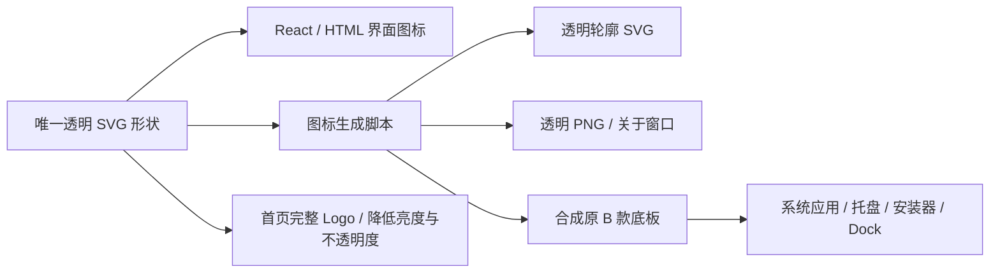
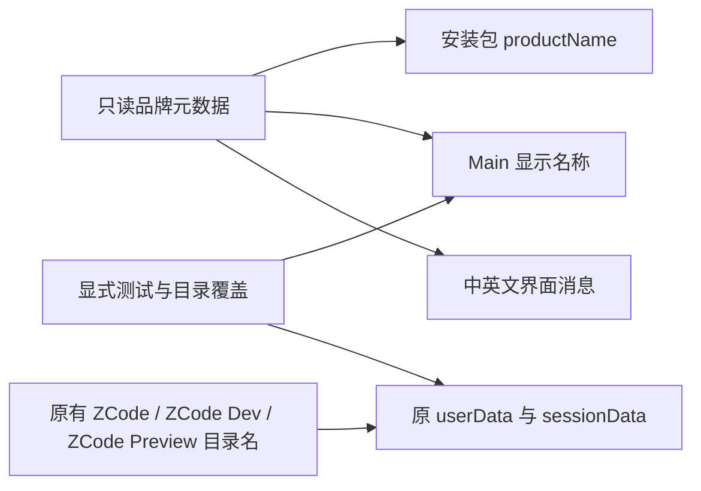

# 郑商智助产品品牌

## 产品规则

- 产品名称：郑商智助。
- 英文标识：CZCE Agent。
- 产品说明：郑商所智能工作助手。
- 一句话介绍：协助处理知识查询、材料整理、数据分析与日常任务。
- 上述介绍表达产品方向，不新增能力或改变现有本地 Desktop 产品范围。
- 仓库目录、Git remote、workspace 包名、CLI 名称、协议、环境变量、appId、Linux 可执行文件名及数据目录继续使用已有标识。
- 中文界面显示中文产品名称，英文界面显示英文标识；安装包及系统应用名称使用中文产品名称，保留 Dev / Preview 区分。
- 保留上游 ZCode 的来源、版权、第三方声明和实际兼容标识；上游服务、插件及导入来源名称不冒充本产品。
- 产品图标采用用户选定的 B「智能助手」：官方图标的错位蓝色方框、两块黄色斜切图形及右上智能光点。图标内不含文字。界面内使用透明背景并收紧留白；系统应用、托盘、安装器及 Dock 图标保留原 B 款浅蓝圆角底板。
- 替换产品用途的 ZCode 图形，覆盖启动壳、React 启动/引导/欢迎、窗口栏/侧栏、对话空白页水印、原生关于窗口、任务/会话 Agent 图标、应用/托盘/安装器、更新状态资源和 README 图标。空白页直接使用完整透明 Logo，保留蓝黄实体填色，以 brightness(0.75) 降低亮度及 20% 不透明度呈现；问候文案、布局和时间切换规则保持。模型提供商、OAuth 来源及第三方产品标识保留各自含义。
- 界面内不叠加原底板的矩形阴影、圆角边框或环形扫光，避免透明图标仍带一块独立卡片轮廓；不改变启动动画的就绪信号、遮罩移除及加载语义。
- `packages/ui/src/assets/branding/czce-agent.svg` 为唯一形状源；由 `scripts/generate-product-icons.mjs` 派生轮廓 SVG、透明 UI PNG、带底板的应用 SVG、多尺寸 PNG、ICO、ICNS 及启动壳副本。底板仅在生成应用资源时合成，不另维护一份主体形状。生成失败直接退出，不保留静默成功状态。

## 所有者和接口

- `packages/shared/src/productBranding.ts` 是只读品牌元数据的唯一来源，通过 shared 公共入口提供给 Desktop、UI 和构建脚本。
- Desktop 产品身份脚本派生正式/Preview 安装包名称；Main 运行时派生显示名称，并独立保留原 Electron userData 目录名。
- UI 通过现有 i18n 消息展示名称、说明、介绍；不新增 store、服务、IPC 或持久化字段。
- 显式 `ZCODE_DESKTOP_APPLICATION_NAME`、userData/sessionData 覆盖和 E2E 默认目录模式沿用现有语义。
- 改名没有业务状态迁移、异步消息或新的失败语义；品牌导入失败应直接导致构建失败。
- React 使用既有图标组件读取透明矢量源；HTML 启动壳引用 public 品牌 SVG；Main 关于窗口读取随 Renderer 打包的 `branding/czce-agent.png`，以透明 PNG data URL 展示，原生窗口自身的系统 icon 仍走既有带底板的应用图标路径。
- 首页水印由 ConversationDraftEmptyState 直接读取唯一透明 SVG，使用 CSS brightness(0.75) 和 20% 不透明度降低视觉强度；没有第二份主题状态或主题专用图片，也不向服务端写入状态。
- 图标没有业务状态、IPC 或持久化迁移；图标生成按「矢量源 → 渲染 → 全部尺寸及格式写入 → 检查」完成，应用的启动就绪信号和遮罩移除语义不变。

## 数据兼容边界

显示名称在 Main 启动时设置；userData/sessionData 在窗口与 Host 创建之前仍由现有运行时目录所有者设置。品牌名称不参与默认持久化目录计算。

## 验收

1. README 中记录四项已确认文案，保留 ZCode fork 来源，仓库名不变。
2. production / preview / development 显示新名称，既有 appId 和 Linux 执行标识保持。
3. 无显式覆盖时，旧 Electron 数据目录保持可读；显式应用名、目录覆盖和默认 E2E 目录模式保持原语义。
4. 中文/英文启动、欢迎、侧栏、托盘和关于文案显示对应品牌；技术协议及上游来源保持原值。
5. 实际 Electron E2E 验证启动、欢迎文案、进入主界面及关于窗口，中英文分别核验；不需要模型请求。
6. 执行品牌相关测试、`pnpm typecheck`、`pnpm lint` 和 `pnpm architecture:check --changed`，如实记录平台与未测范围。
7. Electron E2E 核验构建 HTML 启动壳的隔离渲染，以及真实应用的 React 首次引导、主界面和关于窗口都加载新的品牌资产，DOM 图像加载完成且非空；核验 light / dark 截图及继续进入主界面。React 阻塞启动界面复用同一图标组件，不强制延长实际启动过程来取截图。
8. 静态资产检查覆盖各 PNG 尺寸、ICO/ICNS 容器及 shared 图形源派生副本一致；Windows/macOS 实际系统安装图标分别报告，不能由 Linux 截图推定。
9. 透明 SVG 没有浅蓝底板；透明 PNG、Agent 位图和 Renderer 副本一致。生成后的应用/安装器资源与本次调整前的 B 款保持一致；轮廓资产没有实体填色且形状从透明 SVG 派生。
10. 真实 Electron 中检查启动、引导、侧栏和关于窗口的透明图像边缘 alpha；light / dark 首页水印的完整 SVG 加载成功、内部实体蓝黄填色、brightness 为 0.75、不透明度为 0.2，截图中没有矩形背景或外壳阴影；正常进入主界面并退出。

## 产品改名验证结果

2026-10-01，Node 24.14.0，Linux x64：

- 品牌与数据目录兼容、Desktop 固定产品规则、Main 账号边界和构建闭包测试：15 项通过。
- `pnpm typecheck`：通过。
- `pnpm lint`：退出码 0，70 个警告、0 个错误；未顺带清理无关警告。
- `pnpm architecture:check --changed`：通过，baseline 0、新违规 0。
- 修改文件格式检查及 `git diff --check`：通过。
- `pnpm exec tsx packages/desktop/e2e/run-branding.mjs`：当前源码构建成功，中文/英文真实 Electron 的首次引导、侧栏、关于窗口、显式数据目录覆盖及正常退出均通过，截图人工复核通过。
- E2E 报告和四张截图：`packages/desktop/.e2e-artifacts/branding-1790867900100/`（忽略目录）。
- 默认旧数据目录由真实身份解析函数测试覆盖；E2E 使用独立临时目录，没有读取真实用户数据。Windows/macOS 安装包、系统集成和真实历史会话恢复本轮未实测。

实现范围：shared、ui、desktop 及关联构建/文档；品牌元数据只读，无新增业务状态所有者或异步事件。本次文本行变动：新增 541 行、删除 335 行，净增 206 行（含测试、规格和格式调整）。

## B 款图标验证结果

2026-10-02，Node 24.14.0，Linux x64：

- 从用户确认的 B 款设计绘制独立 SVG，并用既有 Electron 和 ICNS 依赖生成全部资源；没有新增依赖。
- 图标及品牌测试共 4 项通过，覆盖 9 个 PNG 尺寸、原更新状态位图、Agent 图标副本、Windows ICO 的 7 个尺寸及 macOS ICNS 的 7 个尺寸，启动壳副本与 SVG 源字节一致。
- `pnpm typecheck`：通过。
- `pnpm lint`：退出码 0，70 个已有警告、0 个错误。
- `pnpm architecture:check --changed`：通过，baseline 0、新违规 0。
- 修改文件格式检查及 `git diff --check`：通过。
- `pnpm exec tsx packages/desktop/e2e/run-branding.mjs`：当前源码重建成功，中文 Zai Light / 英文 Zai Dark 的引导、主界面图标和空白页水印、原生关于 PNG、进入主界面及正常退出通过；独立窗口渲染构建 HTML 启动壳通过。共 8 张截图人工复核。
- 最终报告与截图：`packages/desktop/.e2e-artifacts/branding-1790870683362/`（忽略目录）。主题通过临时测试目录中的 Renderer localStorage 初始化读取，不把主题当作 setting.json 字段。
- 未在 Windows/macOS 实际安装运行；本轮只验证其打包图标的文件格式和尺寸，不推定系统显示效果。

实现范围：ui、desktop、生成脚本及 public/build 静态资源。SVG 是唯一图形所有者；React 和 HTML 读取同源图标，原生关于窗口读取现有应用 PNG；没有新增业务状态、IPC 或启动就绪事件。当前品牌相关未提交文本变动（含上一轮改名）：新增 928 行、删除 580 行，净增 348 行。

## 透明界面图标与轮廓水印验证结果

2026-10-02，Node 24.14.0，Linux x64：

- 去掉界面图标的浅蓝底板，收紧 SVG viewBox；移除启动、欢迎、关于的方形阴影及引导底板扫光。首页以主题 foreground 的 10% 不透明度绘制透明轮廓，未改变问候文案、布局、主题状态所有者或启动就绪时序。
- 图标和品牌测试共 5 项通过：透明 PNG/Agent 位图/Renderer 副本一致，三种 SVG 的主体几何一致，native PNG/ICO/ICNS 的尺寸和容器有效。
- 生成后的 30 个系统应用、安装器及 Dock 位图/容器文件与此次调整前的 B 款 SHA-256 完全一致。
- `pnpm typecheck`：通过。
- `pnpm lint`：退出码 0，70 个已有警告、0 个错误。
- `pnpm architecture:check --changed`：通过，baseline 0、新违规 0。
- 修改文件格式检查及 `git diff --check`：通过。
- 品牌 Electron E2E：中文 Zai Light / 英文 Zai Dark 的启动图像、引导、侧栏及关于窗口都通过实际 canvas alpha 检查；水印资源加载、内部透明、主题颜色及不透明度通过。正常进入主界面与退出通过，8 张截图人工复核。关于窗口通过媒体偏好模拟其既有浅/深色 CSS；启动壳采用构建 HTML 隔离渲染及既有减少动态效果规则，检查图标可见，不替代就绪时序测试。
- 首次 E2E 发现 Vite 内联 SVG URL 的引号使未引用的 CSS mask URL 无效；修正整体引用后，最终 E2E 全部通过，没有使用超时或图片加载兜底隐藏失败。
- 最终报告及截图：`packages/desktop/.e2e-artifacts/branding-1790872070693/`（忽略目录）。透明预览：`public/logo/czce-agent.png`。
- Windows/macOS 实际安装及系统图标显示仍未实测；本轮保留其既有 B 款资源，没有推定实机结果。

实现范围：ui、desktop、生成脚本及派生图标资源；唯一图形源和现有主题是各自所有者，没有新增业务状态或协议。此次透明图标调整的文本行变动：净增 142 行（相对于开工前未提交工作树，含规格、测试及派生 SVG）。
