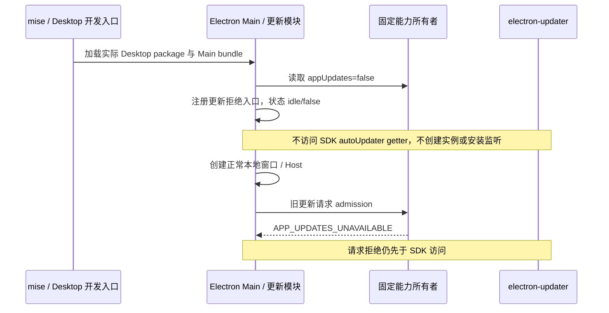

# 本地 Desktop 开发启动：禁用更新器的初始化边界

## 已确认问题与规则

2026-10-01 在 Linux Wayland 桌面使用项目固定 Node 24.14.0 / pnpm 10.33.2 执行 `mise run dev`。Agent、Vite 和 Main/Host/preload 构建成功，Electron 主进程在加载 `autoUpdater.ts` 时崩溃：`App version is not a valid semver version: "0.0"`。开发入口直接加载没有 version 字段的 Desktop package；`electron-updater` 的 `autoUpdater` 属性是会创建实例并校验版本的 getter，不是无副作用字段。

- `DESKTOP_PRODUCT_CAPABILITIES` 继续是唯一固定产品规则所有者，`appUpdates=false` 不变。
- 禁用规则必须在模块加载阶段生效：不得读取 SDK 的 `autoUpdater` getter、创建 updater、注册 SDK 退出安装监听或修改 SDK 实例。
- 所有保留的 SDK 执行路径通过更新模块内部的唯一惰性访问入口，先调用现有 `assertAppUpdatesAvailable()`，再读取 SDK getter。实例仍由 SDK 自身持有，不引入第二缓存、代理实例或可变配置。
- 更新状态、旧 IPC 的明确拒绝、菜单隐藏、历史保留与强制升级不阻断语义保持不变。未创建 SDK 实例就不存在退出安装监听，不再靠先初始化后把 autoInstallOnAppQuit 改为 false 实现禁用。
- 不硬编码 Desktop package 版本，不重新启用更新，不修改 mise/nvm，不依赖重装、清理用户数据或延迟解决启动问题。产品版本继续沿用根版本与现有构建元数据。
- 不修改 Host/Agent、会话、CommandInbox、owner/lease、workspace identity、Skills 或 MCP 所有者及协议。

## 所有者与顺序

## 先测试后实现与验收

1. 修改已有 `updateGuards.test.mjs` 的 SDK stub 为真实 getter 形状；记录访问次数，构造陷阱模拟实际版本错误。重新导入模块应成功且访问次数为零；当前实现必须先失败。
2. 复跑已有禁用更新行为：旧设置/历史读写为零、更新检查/下载/安装为零、强制更新不阻断、旧 IPC/命令明确拒绝；SDK getter 的总访问次数仍为零。
3. 更新已有更新专项 E2E：探针不得主动创建更新器；通过 SDK 构造函数的 `app.getVersion()` 调用栈捕获并拒绝任何实例构造，首次启动和历史重启均断言初始化次数为零。继续覆盖旧 IPC、强制升级网络陷阱、菜单与历史文件保留。
4. 实际运行 `mise run dev`，使用项目现有 Desktop package（无合成带 version 的 app 包），确认 Electron 主进程和 Renderer 能启动、本地窗口可用、更新状态 idle/false。记录真实日志与截图；调查性诊断时间上限不算应用退出失败。
5. 运行 `pnpm typecheck`、`pnpm lint`、changed 架构检查及变更文件格式检查。额外 Desktop Main 的已有诊断与新增诊断区分；不将存量失败写成通过。
6. 保留 `.vscode/settings.json` 等用户本地改动；不创建提交或推送，除非另行明确授权。

## 实际验证（2026-10-01，Linux x64 / Wayland）

使用已安装的 mise 2026.9.17、固定 Node 24.14.0 / pnpm 10.33.2 / Electron 41.0.3。验证基于 `2801086` 加本次工作区修复；之后按用户授权收敛为一个本地提交，不推送。开发进程已按用户要求停止并确认回收。

| 检查                             | 实际结果                                                                                                                                                 | 本机证据（不提交）                                                                                                 |
| -------------------------------- | -------------------------------------------------------------------------------------------------------------------------------------------------------- | ------------------------------------------------------------------------------------------------------------------ |
| 原实现的真实 `mise run dev`      | 构建成功，Main 在 SDK getter 构造实例时抛出无效版本 `0.0`；诊断时间上限与清理产生的信号退出不混称为应用自身退出码                                        | `/tmp/zcode-mise-dev-repro-20261001-205155.log`                                                                    |
| 新测试 red phase                 | 2 项失败：新导入得到同一版本异常；getter 访问总次数 2 而非 0                                                                                             | `/tmp/zcode-dev-startup-red.log`                                                                                   |
| 修复后的单元/聚合测试            | 固定能力与更新测试 4/4；UI/services/Desktop 聚合 188/188 通过                                                                                            | `/tmp/zcode-dev-startup-green.log`、`/tmp/zcode-dev-startup-tests.log`                                             |
| 真实 `mise run dev`              | 实际 Desktop package 仍无 version；Main/Renderer 启动成功，中文引导可见，按实际 UI 跳过引导后对话输入框可见；状态 idle/false、偏好 false、能力仍禁用更新 | `/tmp/zcode-dev-startup-fixed-report.json`、`/tmp/zcode-dev-startup-fixed.png`、`/tmp/zcode-dev-startup-fixed.log` |
| E2E 探针负向对照                 | 在独立临时 Electron app 中故意访问真实 SDK getter，构造陷阱准确阻止一次初始化，退出 0；不靠从未触发的无效探针得出初始化为零                              | `/tmp/zcode-dev-startup-probe-control.log`                                                                         |
| 重建 production/preview 更新专项 | 4 个干净/旧数据场景通过；2 个旧目录正常重启。每场景 8 类请求拒绝，SDK 初始化、强制升级请求及本机 feed 请求均为 0；旧文件保留，正常退出                   | `packages/desktop/.e2e-artifacts/updates-1790860896901/report.json`                                                |
| 根 typecheck / lint              | 通过；lint 0 errors / 70 条已有 warnings                                                                                                                 | `/tmp/zcode-dev-startup-typecheck.log`、`/tmp/zcode-dev-startup-lint.log`                                          |
| 架构、格式与 diff                | changed 架构 0 violations / 0 baseline / 0 new；6 个本次文件格式和 `git diff --check` 通过                                                               | `/tmp/zcode-dev-startup-architecture-final.log`、`/tmp/zcode-dev-startup-format.log`                               |
| 额外 Desktop Main tsc            | 仍失败，87 项，与既有记录总数相同；本次更新模块无诊断。不称为全部 Desktop tsc 通过                                                                       | `/tmp/zcode-dev-startup-main-tsc.log`                                                                              |

变更仍属于非 managed Desktop Main 的原更新模块，没有新增公开契约、依赖、状态副本或例外；所有保留原生 SDK 路径复用内部惰性访问入口。真实开发启动使用既有 `mise run dev`，没有添加合成合法版本、重装依赖、延迟或更新开关兜底。

本轮没有重跑完整模型/Skills/MCP、安装包、Windows/macOS 或全仓格式/knip；不以历史结果代替。本机原始开发日志可能包含设置，只留机器并设私有权限，不提交或上传。所有测试/诊断仅控制各自启动的进程。

## 开发目录隔离的独立观察

真实开发日志确认全局设置服务仍访问默认用户 `~/.zcode/v2/setting.json`；它与 `~/.zcode-dev-home/.zcode` 不是同一路径。源码的设置 owner 优先读取 `ZCODE_DESKTOP_HOME_DIR`，而当前 mise dev task 只设置 `ZCODE_DATA_BASE_DIR`。因此当前任务隔离数据目录并不等于隔离全部全局设置；此前“完全不影响正常使用的数据”的说明不准确。本次只修复用户批准的更新器初始化问题，不顺带改动 settings owner、迁移路径或 mise home 语义，完整隔离需另行对齐。
