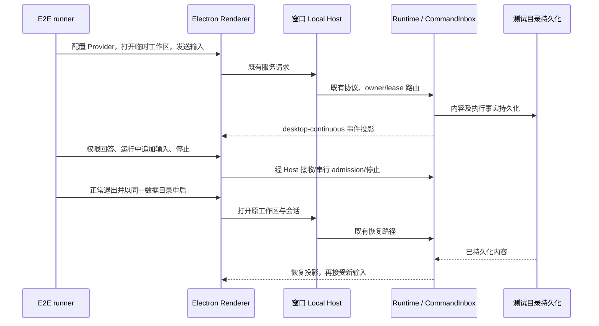

# Issue #1 Desktop 核心 E2E 基线

状态：2026-09-30 完整重建、真实模型 UI 场景及持久化核验已通过，结果见 [baseline-results.md](baseline-results.md)。这里只建立更新关闭前的核心基线，不实现产品能力或更新关闭。

## 范围与规则

- 使用当前检出源码重新构建 Desktop 与本地 Agent；真实 Electron、Host、Agent、DeepSeek 请求参与验证，不以 mock 模型替代实际调用。
- 测试脚本归属 `packages/desktop/e2e/`，通过 Desktop 包的公开测试命令执行；复用已安装的 `playwright-core`，不新增业务状态或生产测试接口。
- 每次运行新建仓库外的私有数据目录与临时工作区；同一次运行的退出/重启复用同一目录。不得修改日常使用的应用数据。
- Desktop 数据、Electron userData/sessionData 与 Agent 的 `ZCODE_STORAGE_DIR`、`ZCODE_SESSION_DB_PATH` 分别显式隔离；仅设置 `ZCODE_DATA_BASE_DIR` 不足以隔离 Agent 默认会话库。
- 测试应用 manifest 使用根 `package.json` 的真实版本；Desktop 包没有 version 字段，直接启动该目录会被 electron-updater 的 semver 校验拒绝。启动器显式传入仓库内置 Provider 配置路径，避免 staging manifest 改变资源查找根。
- API key 从显式指定的仓库外文件读取，通过设置 UI 保存到测试实例。不得写入源码、命令行、截图、报告或网络录制。输入凭据阶段不截图、不录 trace；保留的诊断文本必须脱敏。
- 原生目录选择对话框可由测试替换返回临时工作区路径，其他行为通过实际 UI 触发。现有 E2E store bridge 只读，用于补充会话投影断言，不能写入或伪造运行状态。
- 使用显式 UI/事件/文件条件等待，超时只作为失败上限，不用固定延迟替代 admission、停止或恢复确认。
- 完整退出后再启动；异常退出不得当作正常重启通过。失败时保留失败阶段与已完成阶段，不宣称后续场景通过。

## 所有者与边界

| 事实                         | 唯一所有者                        | 测试观察方式                  |
| ---------------------------- | --------------------------------- | ----------------------------- |
| Provider 配置                | 现有 Provider 配置服务            | UI 保存、持久化及真实调用     |
| 已接受输入、执行、工具和权限 | CLI Runtime / CommandInbox        | UI、现有会话投影及测试文件    |
| 本地绑定与路由               | 窗口 Local Host，既有 owner/lease | 同一真实链路运行，不绕过 Host |
| 草稿及展示                   | Renderer                          | UI 操作与断言                 |
| 会话恢复                     | 既有 Runtime/持久化链             | 重启后读取相同会话并继续对话  |
| 测试阶段、截图及结果         | 独立 E2E runner                   | 运行报告；不参与业务状态      |

本基线不修改 stream/snapshot/queue/reconnect 语义，不作为手机 `web-remote-replayable` 链路的执行证据。单窗口 UI E2E 也不独立证明跨 Host owner/lease 或远程 identity 的完整正确性。

## 验收场景

1. 干净目录启动真实桌面应用，设置 DeepSeek Provider 和可执行模型，配置保存后可选择。
2. 普通对话返回指定唯一标记；模型错误、鉴权错误或额度错误均判失败。
3. 调用工具写入并读回临时文件，UI 展示工具执行，实际文件内容符合要求。
4. 在需要确认的权限模式下触发受控操作，拒绝后无目标文件，重新请求并允许后目标文件出现；不能用模型口头陈述作为执行证据。
5. 在真实任务仍运行时发送追加输入，核对队列/会话和最终执行结果，避免把完成后的普通消息当作运行中追加。
6. 停止尚未结束的任务，确认 UI/会话进入非运行状态；随后新输入可正常执行，旧 run 不产生预设的迟到文件。
7. 正常退出、复用相同数据重启，打开原会话，核对历史标记、工具记录，并完成新一轮对话。

每个阶段保存截图（凭据阶段除外）、脱敏诊断与结构化报告。报告记录 commit、源码改动、Node/pnpm、平台、模型、构建方式、阶段结果与未验证范围。真实运行失败必须留作基线问题，不在本任务中静默修改生产实现。

## 执行与限制

执行入口为 `pnpm --filter @zcode/desktop e2e:baseline --key-file <仓库外私有文件>`，说明见 `packages/desktop/e2e/README.md`；报告只在实际运行后填写。每次执行重建，不使用旧构建缓存。基础检查必须实际执行 `pnpm typecheck`、`pnpm lint`、`pnpm architecture:check --changed` 和新增文件格式检查。

本任务只覆盖上述本地核心场景；Issue #1 的更新关闭、旧更新缓存、请求绕过、Skills/MCP、发行安装包和其他操作系统验证需另外执行，不能从本基线推导通过。
