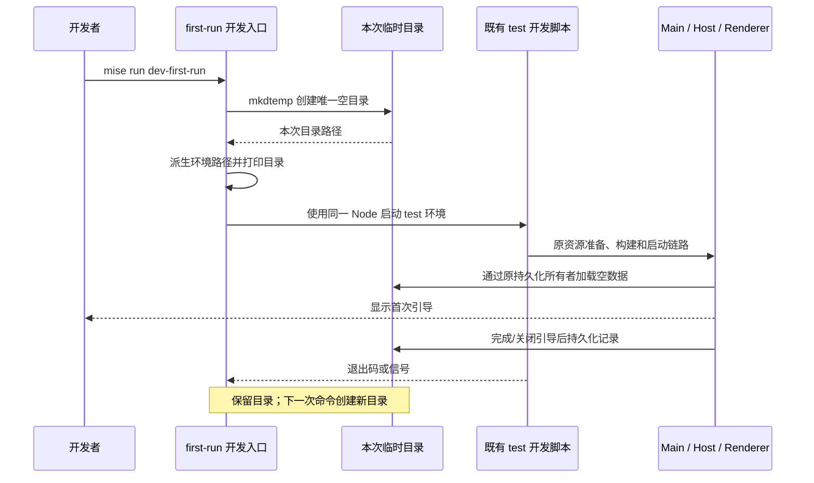

# 首次打开模拟开发入口

## 产品规则与接口

- 新增 `mise run dev-first-run` 和等价的 `pnpm dev:desktop:first-run`，从仓库根目录执行。
- `mise run dev` 的 task、环境与执行脚本保持原样，继续恢复已有开发数据。
- 新入口每次异步创建一个系统临时目录，不接受已有数据目录，不读取、复制或删除日常应用数据。
- 新入口只配置持久化路径，再调用现有 `scripts/dev-desktop-env.mjs test`。运行资源准备、Agent 构建、Electron 与源码监听仍由原启动脚本负责。
- 新入口不强制显示页面，不改写引导完成状态，不添加 UI 或服务测试旁路。全新数据由实际引导判定逻辑识别为新用户。
- 打印临时目录路径；正常退出、失败或中断后保留该目录，便于检查设置、任务与日志。再次执行命令使用另一个目录。
- 该命令模拟应用数据为空时的首次启动；服务配置、宿主环境、已有第三方工具和系统授权不重置，不执行安装器。

## 唯一所有者与边界

`scripts/dev-desktop-first-run.mjs` 仅拥有本次启动的目录分配和子进程生命周期，归属仓库 Desktop 开发工具，不属于 `architecture-policy.yaml` 中的 managed source 模块。业务状态继续由既有 Main、窗口 Local Host、services、CLI/runtime 和 Renderer 各自管理，不新增状态副本、协议、跨包导入或架构例外。

入口在创建子进程前覆盖以下环境变量，避免外部 shell 的旧目录或 Electron 默认目录开关影响模拟：

| 变量                                           | 值                                        | 既有所有者                         |
| ---------------------------------------------- | ----------------------------------------- | ---------------------------------- |
| `ZCODE_DATA_BASE_DIR`                          | 本次临时目录                              | services 数据根与引导记录          |
| `ZCODE_DESKTOP_HOME_DIR`                       | 本次临时目录                              | Main home 与全局设置               |
| `ZCODE_DESKTOP_USER_DATA_DIR`                  | 临时目录下 `electron`                     | Electron userData 与 Renderer 偏好 |
| `ZCODE_DESKTOP_SESSION_DATA_DIR`               | 临时目录下 `electron-session`             | Electron sessionData               |
| `ZCODE_DESKTOP_USE_ELECTRON_DEFAULT_USER_DATA` | `0`                                       | Main 显式目录选择                  |
| `ZCODE_HOME`                                   | 临时目录下 `.zcode`                       | 既有本地 Agent/工具配置            |
| `ZCODE_STORAGE_DIR`                            | 临时目录下 `agent-storage`                | CLI/runtime 存储                   |
| `ZCODE_SESSION_DB_PATH`                        | 临时目录下 `agent-storage/session.sqlite` | CLI/runtime 会话数据库             |

系统 `HOME` / `USERPROFILE` 和工具链环境保持继承。仅隔离 `ZCODE_DATA_BASE_DIR` 不够：设置服务有自己的 home 路径，Renderer 偏好使用 Electron 存储，Agent 会话数据库也有独立路径；已有本地任务还会导致引导判定为旧用户。

## 顺序与失败语义

目录分配失败或子进程无法启动时入口报错并返回非零，不回退到真实用户目录。子进程的非零退出码与信号继续传给调用者。该入口不并行启动第二条开发服务链，使用前须停止占用现有 Vite/开发调试端口的开发进程。

## 验收场景

1. 先补子进程测试：父环境带旧目录和默认 Electron 数据开关，子进程仍拿到同一新目录派生的所有路径；工具链和 `HOME` 保留。
2. 两次入口执行生成不同目录；子进程退出后目录及其模拟记录保留；父环境指定的旧目录文件内容不变。
3. 正常、非零退出与无法启动子进程的结果可观测；入口始终调用原 `dev-desktop-env.mjs test`，不调用生产入口或重复实现准备流程。
4. 配置测试确认 `mise run dev-first-run` 与 pnpm 入口可用，原 `[tasks.dev]` 配置逐字不变。
5. 真实 Electron E2E：使用新入口的环境分配，首次引导可见；通过实际 UI 完成引导并退出；同一数据目录重启不再引导，新的模拟目录再次显示引导。核验实际 Electron 路径，并保留截图与报告。不请求模型。
6. 执行项目固定工具链下的 `pnpm typecheck`、`pnpm lint`、changed 架构检查和本次文件格式检查，区分新问题与工作区已有结果。

## 验证记录

2026-10-05，Linux x64，固定 Node 24.14.0 / pnpm 10.33.2：

- 先新增启动子进程测试，未实现时 6 项失败；实现后 `node --test packages/desktop/test/firstRunDevelopment.test.mjs` 6/6 通过，包含路径带空格的启动 fixture 与子进程 SIGTERM 传递。
- `mise run --dry-run dev-first-run` 正确解析到新增 pnpm 入口；配置测试确认原 `[tasks.dev]` 逐字保持。没有启动日常开发数据实例来验证它，以免改变用户原状态。
- `pnpm exec tsx packages/desktop/e2e/run-first-run.mjs` 从当前源码重建 Agent 与 Desktop，通过 3 个真实 Electron 场景：首次引导、完成后同目录重启、再分配新目录首次引导。三个应用均正常退出；旧文件内容不变，实际 home/userData/sessionData 与新入口的配置一致。该 E2E 使用既有构建测试启动器，实际命令的委派、参数和退出语义由子进程测试覆盖。
- E2E 截图与报告保留在忽略目录 `packages/desktop/.e2e-artifacts/first-run-1791209599140/`，首次引导和同目录重启截图已人工复核。未请求模型。
- `pnpm typecheck` 通过；`pnpm lint` 通过，0 errors / 70 条已有 warnings，本次新增文件没有诊断。
- changed 架构检查在实现前后均为 0 violations / 0 baseline / 0 new；本次文件的格式检查与 tracked diff 空白检查通过。仅增加仓库开发工具及验证/文档，未修改业务状态所有者、受管模块、依赖契约或架构策略。本次净增 450 行（排除用户已有改动），新路径配置在原开发链启动前一次性完成。
- 保留全部与任务无关的工作区改动。本轮未测试 Windows/macOS、系统安装器、真实模型请求或手机链路，不创建提交和推送。
