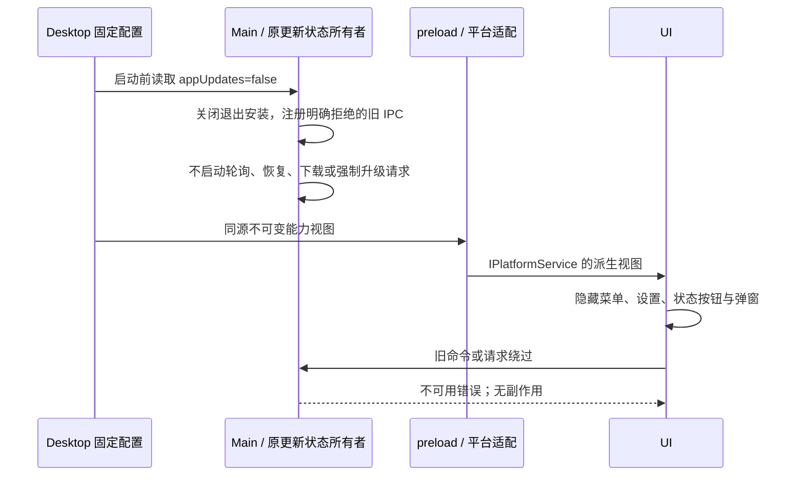

# Issue #1：固定产品能力与应用更新关闭

状态：代码与 Linux x64 本机验收完成。结果见 [实施结果](issue1-results.md)。最终产品范围沿用 `spec.md`，本次只接入应用更新关闭；Windows/macOS 尚未实测。

## 产品规则与契约

- Desktop 产品组装层 `src/main/productCapabilities.ts` 唯一声明不可变的本地产品能力。共享包只定义严格类型、运行时 schema 与不可用错误；不拥有产品选择，也不根据环境、用户设置或远端数据推导能力。
- 本地 Agent、Provider/API key、Skills、MCP 保留。Web、更新、商店、账号、订阅、分享、遥测、远程工作区、手机远控声明最终禁用目标；除更新外均尚待后续 PR 接入，不能把声明视为执行完成。
- Main 和 preload 从同一 Desktop 配置源读取，preload 暴露只读视图，Desktop 平台适配验证后通过 `IPlatformService.productCapabilities` 提供 UI。UI 使用现有平台 hook 读取，不新增 Zustand 状态或可变配置副本。
- Host/Agent 没有应用更新执行职责，本 PR 不新增跨 Agent 协议；后续能力接入应沿既有服务/启动适配传递同源规则。会话、CommandInbox、owner/lease、workspace identity 与两种 delivery 语义均保持原所有者。
- Web 平台尚未接入本地 Fork 配置，保留其既有行为。Desktop 必须显式携带配置，缺失或非法时不得默认启用。契约使用示例为现有 `createDesktopPlatform` 返回的 `IPlatformService`：`productCapabilities: Object.freeze(productCapabilitiesSchema.parse(preloadView))`，UI 经 `usePlatform()` 读取；`preloadView` 是固定配置的序列化视图。
- `appUpdates=false` 独立于 production/preview、打包状态、服务环境、用户设置和开发更新开关。在任何更新网络请求、轮询、下载、退出安装、强制升级和历史恢复之前生效。
- 更新状态读取返回现有 `{kind: 'idle', enabled: false}`，偏好读取返回 false。检查、下载、取消、安装、跳过、偏好写入、打开更新窗口与版本说明确认使用现有 Promise reject 契约，错误包含固定 `APP_UPDATES_UNAVAILABLE`。旧 fire-and-forget 安装请求只记录拒绝，不退出应用。强制升级守卫返回不阻断，强制更新操作报告 error。
- 不读取或清理待安装历史来恢复更新，不删除既有用户数据。更新 publish 配置禁用，不生成自动更新 feed；安装包、签名、运行资源继续保留。

## 所有者与顺序

固定配置没有异步更新、租约或重放。更新状态仍属于原更新模块；禁用时不创建运行中的更新任务。会话状态与持久化不进入产品配置。

## 验收场景（先测试后实现）

| 场景         | 操作                                                                            | 断言                                                                       |
| ------------ | ------------------------------------------------------------------------------- | -------------------------------------------------------------------------- |
| 类型与配置   | 验证完整配置、未知字段、缺字段、冻结与环境无关性                                | schema 严格；配置不可修改；核心能力保留                                    |
| 新目录       | production 与 preview 分别重建启动                                              | UI/原生菜单无更新；状态 idle/false；无更新器检查、下载、安装、强制升级请求 |
| 历史         | 开启自动更新/预览、未来待安装版本说明和缓存，启动、重启、退出                   | 不恢复更新；历史文件保留；无更新弹窗、下载或安装                           |
| 绕过         | 实际 IPC 与旧 Desktop 命令请求全部更新操作，开启开发更新开关并配置本机陷阱 feed | 明确拒绝；陷阱请求 0；更新器调用 0；应用继续运行                           |
| 核心回归     | 复跑真实 DeepSeek 基线                                                          | 对话、工具、权限、busy 追加、停止、正常重启、持久化通过                    |
| Skills / MCP | 用户级/工作区级 Skill，stdio/HTTP MCP 工具                                      | 发现、鉴权与执行正常，提供运行证据                                         |
| 本机打包     | 干净 Desktop 输出生成 Linux 本机目标包并实际启动                                | 资源完整；已打包仍关闭更新，无 feed 配置                                   |
| 平台边界     | 审查 macOS/Windows/Linux 菜单、IPC、安装边界                                    | 通用规则一致；未真实执行的平台如实记录                                     |

测试入口在 Desktop `package.json` 新增，复用现有 Playwright/Electron 与 Node test 工具。不把测试 spy 结果当作其他产品服务停止联网的证明。技能图已补充产品能力、更新执行与更新入口三个节点及两条边，种子文件和符号均已核实。技能引用的 `docs/skills/feature-boundary-graph.md` 当前不存在，不恢复历史文件。
