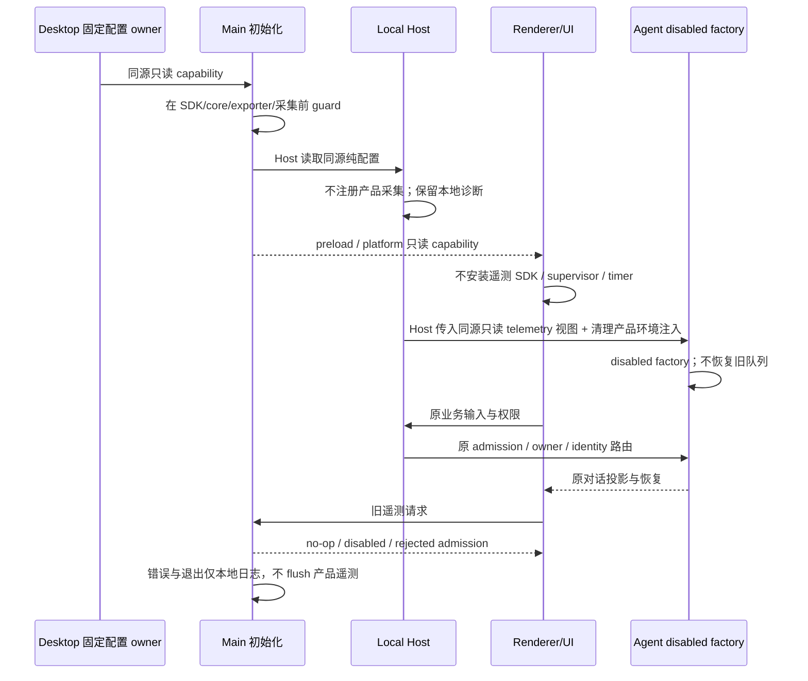
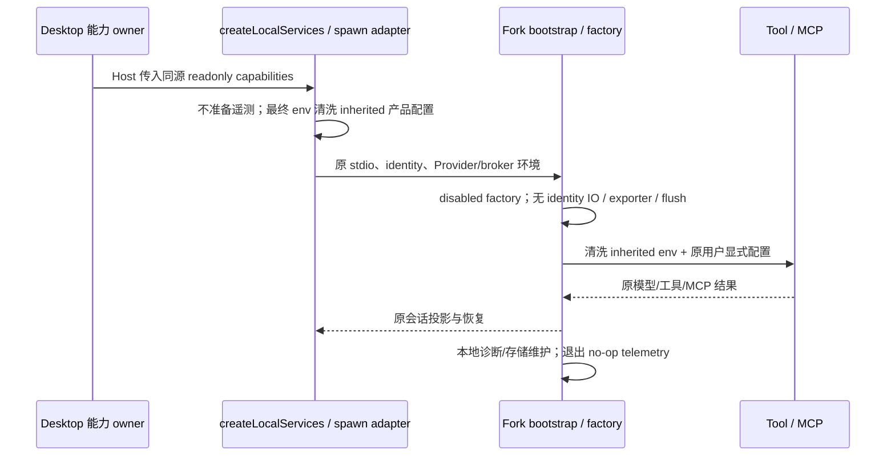
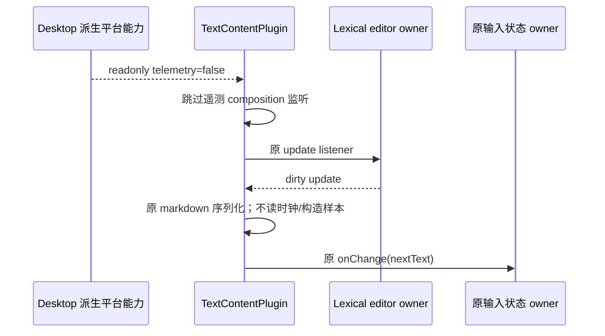

# Issue #2：产品遥测关闭

状态：Desktop/UI、Agent/services 与 scheduler 执行边界及 Host 同源接线已实现；Linux 核心/Skills/MCP 与当前 AppImage 关闭专项已完成。真实结果、已有静态失败和未验证平台见 [实施结果](issue2-results.md)。随 Issue #2 单一提交纳入，不另建 spec 提交。

## 产品规则与所有者

唯一产品事实是 `packages/desktop/src/main/productCapabilities.ts` 的只读 `DESKTOP_PRODUCT_CAPABILITIES`。telemetry capability 在发布身份、用户设置、灰度、环境变量和旧队列之前裁决，不能由上述输入重新开启。各进程的初始化所有者在任何 SDK、exporter、采集任务、订阅或队列恢复之前检查 capability。

| 边界                                                        | 所有者 / 接口                                           | 关闭要求                                                                                                                                     |
| ----------------------------------------------------------- | ------------------------------------------------------- | -------------------------------------------------------------------------------------------------------------------------------------------- |
| Main ARMS                                                   | appARMSBootstrap                                        | 不 init / autoInject / 安装 reporter；不读取 SDK 旧队列，不错误或退出 flush                                                                  |
| Main 业务遥测                                               | 产品组装层 / appTelemetryRuntime                        | 不创建 TelemetryCore、不加载遥测身份与凭据、不启动 launch / DAU 心跳；启动 OAuth 协调仍执行原规则                                            |
| Main 资源、网络、数据量、稳定性、数据库、MCP / remote usage | 各既有采集注册与上报入口                                | 不采样、排队、发送；本地 crash archive、错误日志和数据库启动镜像保留                                                                         |
| Main Trace / TTFT                                           | 既有 exporter、broker、IPC                              | 不创建 OTLP exporter / MeterProvider / periodic reader；旧批次不可 admission，配置请求返回既有 disabled 配置，不请求遥测灰度                 |
| Host                                                        | Host 初始化 / network、self、service、session telemetry | 不注册网络 sink、网络周期任务、Agent/MCP/tool 旁路遥测订阅，不向 Main 转发遥测；本地内存诊断仍按原日志规则执行                               |
| preload                                                     | 原生桥                                                  | ARMS IPC 丢弃旧 SDK payload，不启动 bridge patch 轮询；旧业务上报返回 void，无发送副作用                                                     |
| Renderer / UI                                               | IPlatformService.productCapabilities 派生只读视图       | 不初始化用户操作 SDK、TTFT observer、会话 telemetry supervisor 与打开计时；不记录 ARMS E2E 遥测缓冲，不发送产品遥测；本地日志保留            |
| Agent 启动适配                                              | services 既有进程启动适配                               | 接收 Desktop 同源只读能力视图，阻断遥测准备与产品环境注入；不能复制固定能力事实                                                              |
| CLI Runtime                                                 | bootstrap / telemetry owner                             | 在 exporter、模型 / run trace、资源采集、持久化待发送恢复之前禁用；正常、异常、崩溃与退出均不得 flush / 上传；阻止 Tool/MCP 继承产品遥测环境 |

## 契约与错误

沿用 `ProductCapabilities` 和 `IPlatformService.productCapabilities`，不新增 Agent 协议、不迁移会话状态。产品禁用遥测是旁路 no-op：上报 Promise<void> 正常结束但不表示已导出；批次 admission 返回 false；配置请求返回现有 disabled config。无凭据、端点、设置或旧队列读取副作用。

Main/Host/preload 读取产品组装层纯配置；Renderer/UI 只读取已有平台视图，不直接读取原生桥配置事实。services 公开组装/启动接口接收只读 `Pick<ProductCapabilities, "telemetry">`，Host 传入原 Desktop 配置对象，不能在 CLI/service 复制 Desktop 固定 false。若需新跨进程契约，先更新本 spec 并校验；本阶段不改协议。

## 保留与迁移边界

- 本地 logger、必要 crash 诊断、内存诊断、数据库启动状态、会话存储不删除，不经遥测桥上传。
- 对话事件投影、CommandInbox、owner/lease、workspace identity、stale run、防止重放/恢复边界完全保留；遥测旁路订阅不是对话事实投影。
- 本地 Provider/API key、模型与 stdio/HTTP MCP 正常请求及必要 OAuth、用户/工作区 Skills、Agent shell/网络/浏览器能力不受影响。
- 不清空旧设置、telemetry-state、ARMS 队列或旧数据量 scheduler 状态，不初始化禁用 telemetry owner 以避免队列读取恢复；共享 identity 的既有非遥测初始化边界见 Integration 契约。遥测依赖暂保留，物理删除留后续清理。
- 不宣称账号、市场、分享、relay 等其他产品请求已关闭。

## 初始化与事件顺序

无延时关停窗口、无新增同步超时，无移动端协议语义改动。desktop-continuous / web-remote-replayable 保持原事实 owner 与顺序。

## 验收

1. production / test / development 的 capability 均优先；显式 OTEL/ARMS/trace/TTFT 环境不能创建 SDK、exporter、定时器或恢复队列。
2. 单元测试使用真实入口与端口 spy：Main heartbeat/SDK/exporter/IPC、Host service/network/self/session、preload ARMS 旧桥、Renderer/UI 初始化。先失败再实现。
3. 无凭据 Desktop E2E：重建当前产物、实际启动窗口、触发旧遥测请求与错误上报路径、正常退出；观察 SDK init、网络请求与旧数据保持。不能用无请求的静态搜索代替执行。
4. Agent 组件测试覆盖 bootstrap / exporter / injected owner / inherited env / queue / 正常与模拟异常退出，模型与 MCP/Skills 核心回归由 Issue #2 汇总阶段执行。模拟异常退出不代表真实进程崩溃。
5. 执行 typecheck、lint、architecture:check --changed、受影响文件格式及实际可运行测试。Linux 结果不代表 Windows/macOS/安装包；凭据与平台受限如实列出。

架构受控上下文：desktop、ui、shared 当前都是 legacy / managed:false，module.ts 缺失、无直接依赖契约；复用现有公开 shared/UI 入口，不修改架构 baseline。

## Desktop/UI 实施说明与交接

- ARMS 模块导入本身创建 client 并注册 Electron scheme，因此实际 Main 使用产品 guard 之后的惰性 SDK 加载，禁用产品根本不导入模块。旧 Main IPC、Host 遥测 ingress、preload ARMS IPC 和 UI collector 各有执行 guard；不能以 enable:false 代替这些 guard。
- Main 原本借资源采集节拍写本地内存日志。禁用产品现在只保留 60s 自身内存诊断，不运行角色/系统遥测采样或上报任务；Host/Renderer 本地内存日志亦保留。原生 crashReporter 明确 uploadToServer:false，既有本地 archive 诊断继续运行。
- 已批准支持性 tsconfig.host 调整：rootDir=src，include 明确加入纯 main/productCapabilities.ts，沿用 preload 同源读取。tsc 输出变成 out/host/host/\*；实际 dev/build/打包入口由 tsup 独立生成 out/host/index.js，实际 Electron E2E 已验证。未引入 Main 业务依赖。
- 后续 Agent 注入 seam：`packages/services/src/node.ts` 的 telemetry preparation / `buildAgentTelemetrySpawnEnv`（约 2208 行），以及 Host `createLocalServices` 调用（约 2841 行）。Desktop/UI 阶段未编辑 services 或 CLI。Agent 阶段已提供 `createLocalServices.productCapabilities` 只读输入与 disabled factory/env 边界；integration 已在 Host 调用传入同源 capability，不改变 Agent 业务协议与正常 Tool/MCP 网络。
- `shared/armsRumShared` 有 tracked JS/d.ts/map 旧生成副本，Main 当前只读取 collectors 和 parseViewName；无 `buildArmsBrowserInitConfig` 消费者，不新增这一纯 helper 的接口 guard或同步旧生成副本。Issue #7 依赖审计记录显式 .js 解析事实；实际 SDK 执行口以打包 E2E 证据为准。

本机验证：Desktop 单测 9 项、UI 单测 3 项；无凭据 Linux x64 Electron E2E production/test × 干净/旧队列共 4 场景通过，SDK 未加载、产品遥测/显式 OTEL 请求为零、退出码 0、旧状态不变。根 typecheck 通过；lint 0 errors/70 warnings。额外 `tsc -b packages/desktop` 检查失败（216 条 Main/scheduler/preload/renderer rootDir、声明、DOM 等诊断），不将其标记通过，未在本阶段扩大修复范围。组件阶段不验证模型对话、Agent 全链、Skills/MCP、真实崩溃与发行包/其他平台；integration 补充的实际核心/Skills/MCP 与 AppImage 证据见结果文档，真实崩溃与其他平台仍未验证。

## Integration 验收契约

真实源码调用链复核发现 scheduler utility process 仍在 `startSchedulerResourceTelemetry` 构造 CPU/heap sampler 并注册采集 timer；Main 丢弃样本不足以关闭采集。该注册口与 Main/Host 一样消费同源只读 capability，在 sampler/timer 前返回 no-op stop，保留 scheduler 派发和普通 logger；已批准 scheduler tsconfig 同 Host 一样 rootDir=src、显式 include 纯产品配置，实际 tsup `out/scheduler/index.js` 保持不变；不为该原本无本地诊断日志的采集器新增诊断 owner。先补会失败的真实注册口测试，再修复，重新构建实际 E2E 与 AppImage。

Host 在唯一 `createLocalServices` 装配调用传入 `DESKTOP_PRODUCT_CAPABILITIES` 原对象（只读遥测视图），不另设布尔常量、不改变初始化先后。用源命名的装配测试在接线前验证缺失，再以实际 Desktop 核心回归覆盖该装配入口。

核心基线增加可选 `--telemetry` 验证模式：启动前设置显式 OTEL/trace/TTFT 环境与临时旧 telemetry-state，在对话、Bash、权限、追加、停止、重启、Skills/MCP、退出期间保持本机 OTLP 陷阱，退出后断言请求为零、旧队列/其他字段保持原值、Renderer SDK/遥测缓冲缺席。该模式只输出计数与布尔结论，不输出环境值或凭据；正常模型/MCP 网络仍允许。它与组件 factory/环境测试共同提供四类进程证据，不以零陷阱请求断言其他服务全部停止联网。

已批准共享身份边界：Main `ensureDesktopDeviceMidSync` 的 `deviceMid` 同时供 help/context config、preload/native 与反馈等非遥测消费者，沿用既有 identity owner，不另设计设备身份。已有合法 deviceMid 的旧 telemetry-state 字节不变；缺 deviceMid 的旧文件允许仅新增该共享身份，原队列/其他字段保持原值且不恢复上传。产品关闭不禁止非遥测身份初始化。首次真实核心 E2E 在最终字节断言发现这一行为（此前 14 核心阶段通过，整体该次失败），修正规格/断言后重新执行；不能通过只预置合法身份隐藏该边界。

当前 integration 不修改产品交互（测试目录固定英文 locale 以匹配基线选择器），不新增协议或状态 owner。发行验证重新构建本机 AppImage，再实际运行关闭专项；平台/凭据限制写入结果，不用旧 Issue #1 包代替当前源码。

## Agent/services 实施契约（本阶段）

已批准：本 Fork 的 CLI 源码（含 standalone CLI 开发入口）不另发行，产品 telemetry bootstrap / public factory 不再提供启用执行路径。它们直接提供 disabled/no-op 契约，不新增 CLI 固定 capability 副本。Desktop 产品组装层仍是唯一能力 owner；services `createLocalServices` 接收可选只读 `Pick<ProductCapabilities, "telemetry">`，沿既有 Agent env 适配传递只读视图；即使旧组装方遗漏输入，Fork Agent factory 也不能被 endpoint、显式 enabled 或旧 owner 注入重新启用。

- services 不读取遥测账号、device identity 或 captured OTEL，不准备或注入产品遥测。Agent spawn 最终合并环境之后仅清洗 inherited 产品遥测键，不能影响 broker、Provider、代理、CA 或 identity。
- shared runtimeEnv 扩展 inherited `OTEL_*`、`ZCODE_TELEMETRY_*`、`ZCODE_MODEL_TELEMETRY_ENABLED`、`ZCODE_*RESOURCE*` / `ZCODE_*TTFT*` 清洗；工具 passthrough JSON 无法重新注入。保留用户显式 MCP server env 与 shell 命令的正常语义，不禁止第三方自身遥测/网络。
- bootstrap 不捕获或准备身份、不读取旧 telemetry-state/队列、不动态加载 SDK；模型/运行 no-op writer 不触发 SDK/flush，注入旧 owner 也不调用它。Exporter factory 返回 disabled owner。关闭、异常与重复 shutdown 都是无副作用 Promise<void>。
- MCP tracker 保留纯本机进程列表及连接/owner 生命周期，用于资源管理器和回收，不构造资源探针/采样定时器、不 emit 产品事件。Bash 资源旁路 no-op，不安装进度订阅；正常输出轮询保留。CLI 周期仅保留本地内存诊断与 resident/session 存储维护，不生成资源遥测样本。TTFT 旧 envelope 不注册 observer/clock/队列；CommandInbox admission 不改变。
- errors 为现有旁路 no-op，业务错误/权限/模型流与恢复仍走原链；旧数据逐字节保留，无删库/队列恢复。无新增协议/超时/状态 owner。

先补会失败测试：真实 env 合并、passthrough、Bash/MCP env；显式 endpoint + enabled 的 factory/exporter/owner 注入；临时旧 state 保持；resource timer/probe spy；TTFT 旧 envelope；独立子进程正常与模拟异常 shutdown 的网络 trap。实际执行 CLI 依赖构建、typecheck/build、根 typecheck/lint/architecture；Desktop 接线与凭据核心回归已由 integration 完成，记录实际命令与结果，不用组件 factory 测试代替全链证明。services/shared/zcode-cli 均 legacy managed:false，无 module.ts 或直接依赖契约（CLI 仅发现既有 tools/contract.ts）；不修改 baseline。

## Fresh review 修复契约

仅修复本 Issue 的两个有源码证据的漏口，不改变能力 owner 或协议：

- inherited 产品键统一识别器补齐 `ZCODE_ARMS_RUM_ENDPOINT` 与 `ZCODE_RENDERER_ACTION_TRACE_ENABLED`（含大小写变体），用于最终 Agent env 合并、runtime 清洗、Tool/MCP env 和 passthrough 清洗。模型凭据、代理、broker、identity 保留；用户显式 MCP server env 与 shell overlay 仍在原 transport/命令边界后合并，不禁止第三方自身配置。过滤为纯函数，无新增 IO/错误语义。
- `LexicalChatInput.TextContentPlugin` 读取 `useOptionalPlatform` 的只读能力视图。禁用时在 composition 遥测监听注册、`performance.now()` 和 lag/task 属性构造之前裁决；正常 update listener、首字符回传、markdown 序列化及 `onChange` 保持。缺平台视图沿用既有行为，不复制固定 false。卸载/能力切换清理已安装的 composition 监听；禁用只是遥测旁路 no-op，不改变 IME/键盘业务控制。

验收先 red 再 green：最终 Agent 合并与真实 Tool/MCP 构造不保留两键，正常凭据/显式 overlay 保留；执行实际源文件的 TextContentPlugin effect/update callback，禁用不注册遥测 root listener、不读时钟、不构造样本，首字符/后续变化仍序列化回传，未变化不重复回传。保留启用路径和监听回收回归。实际 Desktop E2E 增加输入更新断言；本轮不宣称旧 AppImage 是修复后源码。
