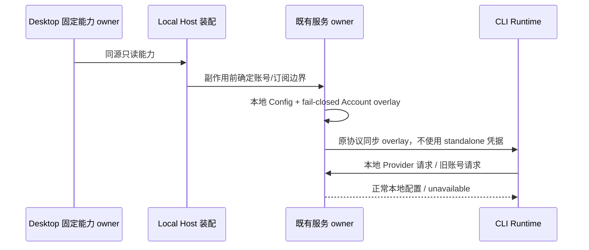
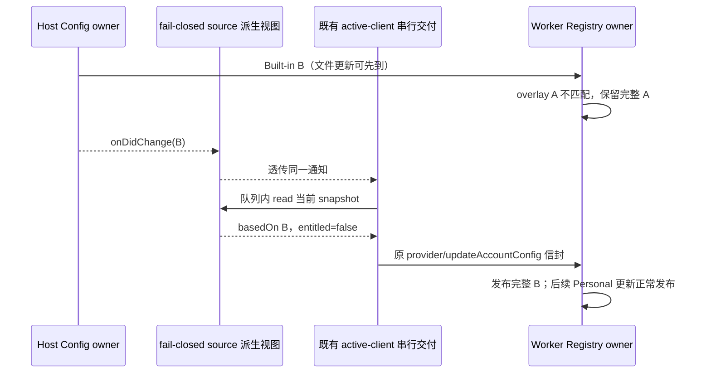
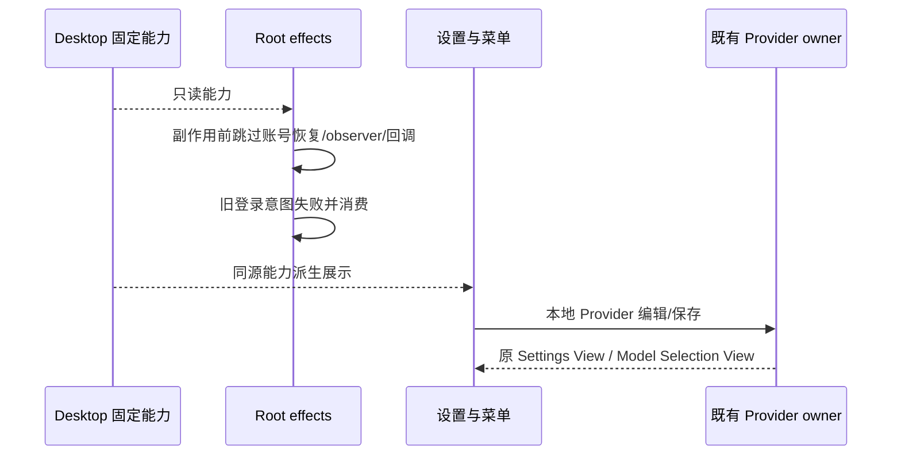
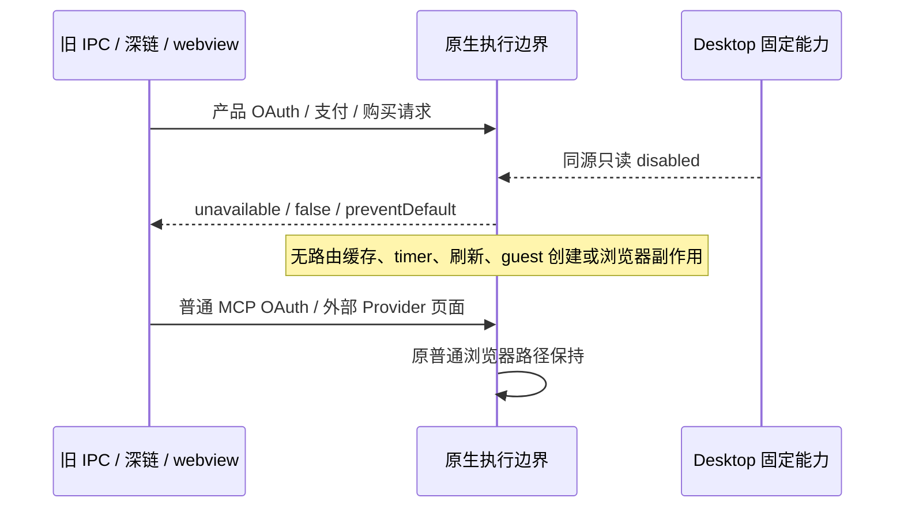

# Issue #3：产品账号与订阅关闭

## 规则、所有者与迁移

Desktop 产品组装层 `DESKTOP_PRODUCT_CAPABILITIES` 是能力的唯一所有者；Host 将同源只读 `productAccount`、`productSubscription`、`appUpdates`、`telemetry` 视图传给 `createLocalServices`。服务工厂接受可选只读能力视图；未传入的非 Desktop 调用方保留原默认行为，不复制本产品固定配置。

Provider Config / Registry / Credential Service 继续拥有本地模型、API key 与选择；关闭账号不移动会话事实、CommandInbox、owner/lease、identity、stale-run 或恢复状态。不清理旧账号 token、团队连接、缓存、凭据文件或闲时任务。旧数据不可恢复为可执行账号事实。

## 接口与失败

- OAuth 读取为 `[]`、`null`、`{status:"signed-out"}`，不读旧凭据；登录、轮询、callback、刷新、logout/switch 明确拒绝 `PRODUCT_ACCOUNT_UNAVAILABLE`，无 adapter、timer、网络或写入副作用。取消 pending 可安全 no-op；401 条件退出返回 false，不能删除旧数据。
- 账号模型源不装配，使用现有 `EmptyAccountProviderConfigSource` 生成与 Built-in revision 对齐的 `entitled=false` overlay；Host 仍把此 overlay 同步给托管 Agent，不能省略来源后恢复独立 CLI 账号。
- Desktop 远端 workspace 的本机账号服务装配也接收相同能力，不能借旧 tab 恢复本机 token；远端产品连接关闭归 Issue #5。
- 官方账号 MCP 身份头解析在读取旧账号 token 前返回既有 `official_auth_unavailable`；通用 MCP OAuth 不经此服务。Feedback 保留匿名设备路径，但不能用旧产品 JWT 恢复账号工单读取或注入身份头。
- 请求期账号 access 返回 null；账号鉴权请求/校验拒绝 `PRODUCT_ACCOUNT_UNAVAILABLE`；账号 credential load 返回 null（连旧缓存都不读）；远端 API client 在 disabled 调用时同样拒绝。
- 账号 provisioning source 的 `read` 拒绝 `PRODUCT_ACCOUNT_UNAVAILABLE`；不触发账户/凭据/个人配置 provisioning 回调，不注册 disabled target。
- 套餐、购买、支付、团队/Start Plan 读取和产品权益/用量/reset 拒绝 `PRODUCT_SUBSCRIPTION_UNAVAILABLE`（账号关闭也拒绝）。App Usage 仍读取本地 Agent 数据库。
- Off-Peak 属账号套餐消费，不恢复 sync/outbox，不提供 mock 环境绕过；支持视图 unavailable，派发校验 false，创建返回既有失败分类，其余执行命令明确拒绝，无数据写入。历史读取保留原模型身份，派生不可调度；普通 automation 不改变。
- `getForceUpdateConfig` 在 `appUpdates=false` 返回 null，不 fetch。动态工作流通用 config 保留原语义（无 OAuth header），context budget 保留固定 preflight-v1；不按 subscription 文件名删除通用能力。
- Built-in CDN catalog 与本地 Personal 配置保留；catalog 刷新不是账号凭据拉取，账号 provider 始终 fail-closed。本地 API key、Provider 错误、通用 credential、stdio/HTTP MCP 和 MCP 自身 OAuth 均保留。
- 公开读取沿现有 IOAuthService、IModelSelectionService、IProviderSettingsService、IUsageStatsService、ICodingPlanSubscriptionService；错误码经 `@zcode/services` / `@zcode/services/node` 公开，普通 Error message 可跨既有 RPC 传播，不改协议。

## 时序

能力固定于装配生命周期，不能由旧 settings 或环境开启；无新增 timeout、owner、状态副本或重放协议。独立源码 CLI（显式 standalone）保留原兼容，本轮不宣称其登录入口关闭。

## Fresh review 修复：已运行 Worker 的配置热同步

配置事实仍归 Provider Config Service；禁用账号 source 只派生 fail-closed overlay，不拥有缓存或凭据。`EmptyAccountProviderConfigSource.onDidChange(listener)` 必须转发 config source 的通知与 unsubscribe，不能因无账号 IO 而截断既有 Agent 热同步。每次读取均按当前 Built-in revision 生成 `entitled=false`；已有 Agent 沿原串行交付队列读取并发送 overlay，Worker Registry 原 mismatch 保留整份旧快照的规则不改。失败沿原热同步日志/Registry 错误契约传播，不增加重试、timeout 或 readiness 替代路径；个人配置事件亦透传，overlay revision 未变时由既有交付去重。

验收：实际运行的 Worker Registry 在 A 已发布后先收到 B config、仍保留 A，再通过禁用 source 通知收到 revision 对齐的 B overlay，自动发布 B；后续本地 API key/endpoint 更新能发布，账号仍不可执行。退订后不通知。该回归隔离 Worker Registry 与来源通知，不冒充完整 stdio Agent/E2E。

## 服务验收（先失败测试，再实现）

1. 旧有效/过期 token、损坏账户凭据都不可读/恢复；OAuth 全部绕过命令无网络、adapter、timer、save/delete。
2. 账号凭据 cache/forceRefresh、直接 API request、请求期鉴权、provisioning read 均在 IO 前停止。
3. 套餐全部方法与 usage/reset 请求拒绝，无 load/network；App Usage 与固定 context budget 可用；通用动态 workflow 不误删。
4. 真正 Provider Runtime 读取 Built-in + 本地 Personal，账号模型不进入可执行 Registry，本地模型与 API key 保留；托管 Agent source 没有 standalone fallback。
5. 旧 Off-Peak 数据不启动 sync/outbox；显式 sync、继续、创建和派发不能绕过，mock 环境不能伪装订阅有效。
6. 非 Desktop 默认调用方与通用 MCP 凭据保留现有契约。UI、Main 深链和交互 E2E 的验收按下文集成规则执行，最终结果见 `issue3-results.md`。

## UI 派生规则与交互验收

UI 只读 `platform.productCapabilities`；缺省能力保持非 Desktop 调用方兼容，不维护第二能力或模型事实。Provider Settings / Model Selection 仍是唯一模型 owner；本地设置直接复用现有 `useModelProviders`、Personal overlay 保存和 InlineEditableProviderCard，不能拿旧账号 token 判断本地配置可用性。

- productAccount=false：Root 不恢复账号、不订阅 JWT/OAuth 回调、不轮询或建立账号连接失效观察；renderer-ready 仍通知。旧 loginEntryRequest 被消费为失败，不自动打开 OAuth；引导与菜单不展示登录/注册/退出/切换。
- productSubscription=false（或账号关闭）：套餐 dialog provider 在 inventory 查询前阻止打开；权益、产品用量与产品套餐 hooks 不读缓存或发起后台请求；本地 App Usage 保留。聊天工具栏与错误不导向购买/登录。
- 模型设置仅从现有 Provider Settings View 派生可编辑的非 `zhipu-account` Provider，仍包含用户 API key 类型 `zhipu-coding-plan-api-key`。账号源旧 intent 不改持久模型身份，显示本地配置提示及 Add Provider 动作；endpoint/API key/模型增删开关、测试、排序继续走原接口。
- Provider 鉴权/额度错误保留原摘要、详情、复制与重试；旧账号模型 unavailable/missing 增加设置动作，不假装已购套餐或吞掉错误。

先补可失败测试：禁用 Root effect 注册、旧 intent、订阅 guard 与本地导航契约；再执行无凭据 Desktop E2E，真实启动、打开偏好菜单、无产品账号/购买项、打开模型设置、保存本机 fixture endpoint/key/模型、重启确认。E2E 不调用外部模型，不证明有凭据模型/工具或 MCP OAuth 闭环。Main callback/购买深链 guard 按下文集成 seam 独立验证，不在 UI 中替代 Main 执行边界。

UI 无凭据可执行入口：`pnpm --filter @zcode/desktop exec tsx e2e/run-account.mjs`；guard 单测：`pnpm exec tsx --test packages/ui/test/productAccount*.test.*`。UI 守卫不替代服务/原生端口拒绝。原有非 Desktop 默认能力行为、外部 API-key Provider、自身额度错误和用户/工作区凭据设施保持兼容。

真实 E2E 发现通用 Client Scenes 中仍有 `NAVIGATE:AUTOMATIONS:OFFPEAK` 推荐动作；其属于已关闭套餐消费者，不应显示或执行。UI 在显示与动作 admission 使用同一纯派生规则拒绝该动作，保留普通 `NAVIGATE:AUTOMATIONS` 与无套餐动作，不关闭通用 Client Scenes/自动化网络。旧 Off-Peak 历史可阅读，但无创建、继续或套餐刷新入口。

## Main 集成执行边界

交接核验确认 UI 不订阅回调仍不足以阻止 Main 缓存/投递旧 OAuth/支付与打开购买 webview；集成仅补这些原生 seam。Main 读取同源 Desktop 配置，不拥有账号/模型事实。

- `registerOAuthState` 在 Map/timer 前抛 `PRODUCT_ACCOUNT_UNAVAILABLE`；旧单向 IPC 在相同边界记录该不可用码并返回，不让异常造成 Main 崩溃。OAuth callback/handled 与支付 callback 在路由、聚焦、缓存和刷新之前停止；`handleDeepLink` 返回 false，日志只记录不可用码，不记录 state/code/token。
- OpenExternal 只识别既有产品 callback 解析器、产品官网 OAuth 中转 `/app/oauth/login` 和对应 redirect/redirect_uri、既有 BigModel 注册 `/login`，以及现有可信 embedded Coding Plan/支付 URL 与来源上下文。正常 MCP localhost OAuth、用户 Provider 文档/额度页面、普通外部浏览器和普通 PayPal 页面保留；不按域名或 auth/oauth 字符串封禁。
- `will-attach-webview` 在 guest/preload/partition 访问前拒绝产品 embedded 购买页；既有 guest 的购买 popup/navigation 在 loadURL/openExternal 前拒绝。普通浏览器 guest、CDP/owner/lease 和页面能力不变。
- Main 单向接口维持原 void 契约，拒绝日志明确说明不可用；不新增 IPC/协议、不清理旧数据。renderer-ready 始终保留，不因旧 callback 阻塞本地启动。

集成先新增实际 Main handlers 与路由模块测试（原实现应失败），再执行真实 Electron 请求绕过、旧凭据保留、本地模型配置重启；实际核心/Skills/MCP 使用仓库外私有 key。安装包/平台/OAuth 凭据限制按最终结果记录，不用源码搜索代替行为证据。

原生验收同时调用现有 guest popup/navigation handler（旧 guest fixture）与真实 DOM will-attach-webview，断言购买不可执行、无 openExternal/loadURL、无 callback 投递；正常外链仍走原 browser owner 路径。支付 callback 的 `embedded=app` 可位于同源 `returnTo` 而非顶层 query；attach、popup 与 navigation 必须复用既有 `isCodingPlanPaymentCallbackUrl` 识别来源与目标，普通 PayPal/Provider 页不扩大封禁。账号专项允许 `ZCODE_ACCOUNT_E2E_ENV=production` 重建正式身份，否则 test；该变量仅配置测试构建身份，不能变更固定产品事实。
