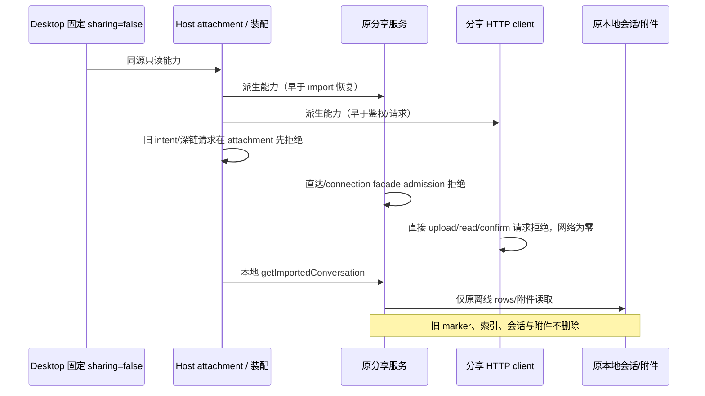
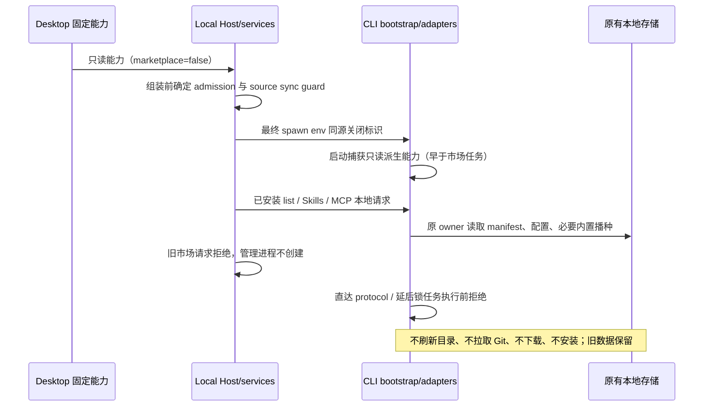
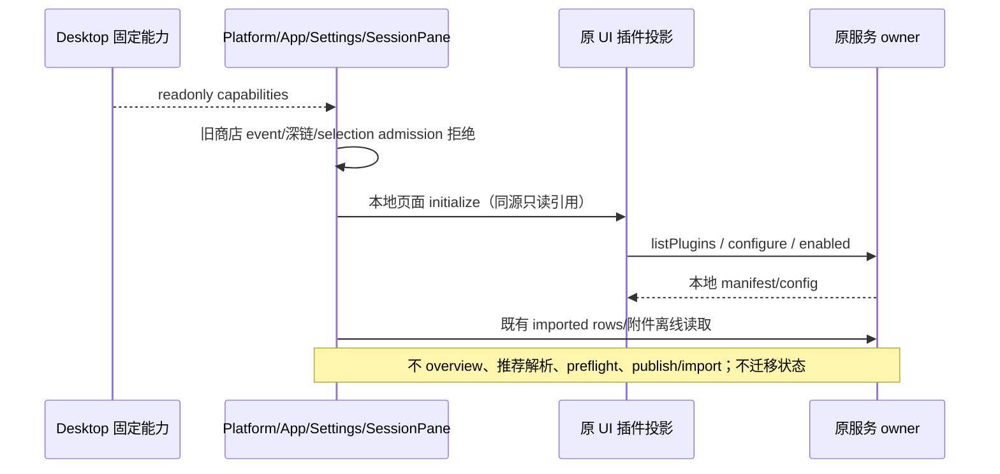
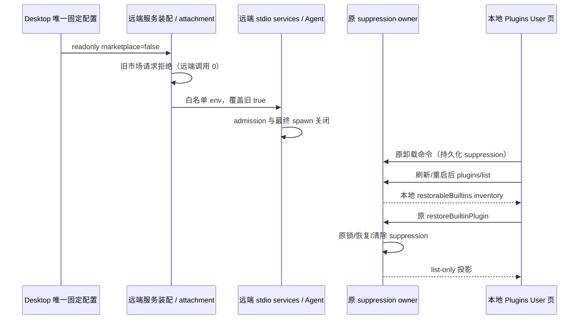
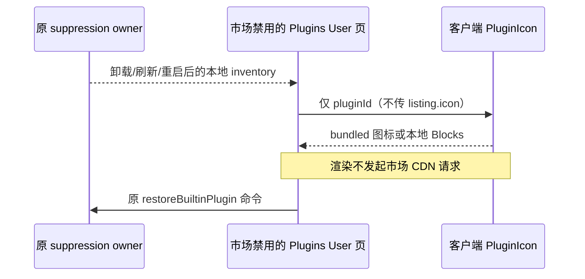

# Issue #4：关闭市场分发与分享，保留本地资源

## 产品规则与实施分界

Desktop 固定配置 `DESKTOP_PRODUCT_CAPABILITIES` 是能力唯一所有者，`pluginMarketplace` / `sharing` 不可由设置、旧数据、服务环境或远端恢复开启。本规格覆盖完整 Issue；市场服务/Host/CLI 执行 seam 已由前序阶段实现；分享服务/HTTP/Host attachment 与 UI admission、页面 effects 已由串行组件阶段落实。整体 Issue 的验证由最终集成阶段汇总，不以组件测试宣称全部场景通过；安装包与跨平台限制必须单独记录。

官方市场与个人来源（包括 Git/GitHub/URL/本地目录市场和 inline 商店安装）的浏览、详情、来源管理、自动/手动刷新、下载、检查更新、安装、更新与推荐引用解析均不可用。旧请求和旧排队操作在实际执行前拒绝。市场禁用不删除旧市场缓存、安装记录、用户配置或数据，也不提供替代分发系统。

会话分享发布、附件上传、权限设置、链接生成/导入、旧 share intent/深链均须在服务执行前返回明确不可用；本地会话、附件读取/复制与恢复不变。UI 不展示商店/分享入口或推荐/跳转，Skills、MCP、Subagent 本地设置不依赖商店访问。

## 所有者与接口

- Desktop 产品组装层拥有固定事实，通过 `createLocalServices.productCapabilities` 传入只读视图；services/CLI 不维护第二份可变产品配置。
- services 的 IPluginManagementService 和直接 IZCodeAgentService 都有 admission guard，在取得/启动管理进程前拒绝市场请求。
- 实际插件安装记录、缓存、配置写入与动态操作仍归 CLI bootstrap/adapters。Desktop 最终进程环境注入同源 `ZCODE_PRODUCT_PLUGIN_MARKETPLACE_ENABLED`（false），CLI adapter 启动时捕获只读派生能力；后续 env/config 修改不能重新打开。没有 Desktop 组装的独立 CLI 保持既有默认行为。本轮不把普通 shell、浏览器、网络 Provider 或 MCP 网络能力变成产品市场能力。
- CLI public bootstrap 市场 API、protocol handler、adapter 网络/Git/源物化入口在副作用前拒绝；源物化/安装等待锁后也检查，不能只 guard 客户端。现有动态操作队列是进程内 promise/锁排队，不新增持久化队列或第二状态所有者。
- IPluginSyncService 的市场 source archive 导出/导入（目录/文件/settings）属于来源管理，禁用时在读源/解包/创建目录前拒绝。已安装本地插件候选/归档与本地配置导入保留原契约；远程工作区同步是否允许归 Issue #5，不批量删除同步服务。
- IPluginsService 已 retired；禁用市场时 legacy 市场请求也返回统一不可用，不恢复旧实现。
- services/desktop/zcode-cli 当前均 legacy/unmanaged，无受管模块 CONTRACT；沿现有公开包入口，不迁移状态，仅在 fresh review 修复中扩展既有 plugins/list 可选离线 inventory 返回字段（见下文），不新增写命令。

## 保留边界与错误

`PLUGIN_MARKETPLACE_UNAVAILABLE` 是明确的拒绝错误标识（Promise rejection / 既有 protocol error）；不伪装刷新、安装成功。市场 validate/describe 可能读取来源或下载，因此拒绝；本地 manifest/path 校验 API 保留。

保留 manifest、installed loader、内置插件播种和本地恢复、已安装 list、配置/reset、启停、卸载与插件/Skill 对话引用 catalog。引用 catalog 不以禁用市场 overview 获取 listing；manifest/本地资源继续提供能力身份，Session 冻结 catalog 原边界不变。取消旧操作继续允许，不通过取消入口创建市场任务。

用户级/工作区级 Skills 发现、加载、必要目录管理；stdio/HTTP MCP 配置、enabled、必要凭据/OAuth 和 Agent 执行保持不变。Skills 与 MCP sync 当前无市场请求，不新增产品账号或市场依赖。保留 CommandInbox、owner/lease、workspace identity、stale run、会话恢复及 desktop-continuous/web-remote-replayable 语义，不改会话内容或队列。

## 分享执行契约

- Desktop 固定 `sharing` 经 `createLocalServices.productCapabilities` 与远程 workspace 服务装配传入 ConversationShareService / ConversationShareHttpClient 的只读派生视图。非 Desktop 未传能力的调用者保持原默认行为，不复制固定产品事实。
- 分享服务在 capabilities/preflight/publish/preview/continuation/import admission（包括 attachment 的 connection-scoped facade）先拒绝，错误 `kind=feature_disabled`，消息 `Conversation sharing is unavailable in this product`，沿用既有 RPC 错误 details，不新增协议字段。权限/access mode 与链接生成属于 publish，不另设执行路径。
- HTTP 公共发布 prepare/upload/confirm、preview/continuation/capabilities 在鉴权和 request 前拒绝，上传入口拒绝早于描述符解析/Blob 表单构造。旧请求不能借缺登录态伪装 auth 错误，也不能借直接 client 请求绕过。
- Host attachment 在连接 scope / clientMode 分流前读取同源 capability；即使遗留可执行 service 仍存在，也统一拒绝网络方法，进度为空事件。桌面本地 `getImportedConversation` 委托原本地读取；手机无 workspace 副本仍返回 null。正常 desktop-continuous/web-remote-replayable 语义不变。
- 禁用时不加载完成导入索引、不运行 abandoned-import cleanup，不删除旧 marker/附件/索引；import 在 dedupe 命中前拒绝，不能把旧成功记录当新导入成功。已保存 `shared-conversation.json` 与普通 transcript、附件的阅读/复制走原本地 owner，不受分享禁用影响。没有新队列、状态迁移、超时或转移 owner。

分享验收：直接 HTTP 上传与权限/confirm、旧预览与 continuation 请求全部 feature_disabled，tokenProvider/API 网络调用为零；服务 publish/preflight/import（包括已完成索引和旧残留 marker）均在 Agent/download/session/write 前拒绝；Host 两种 clientMode 及连接就绪/未就绪拒绝旧请求；本地只读副本与附件字节保持、可读。专项执行测试使用本机 HTTP request 计数器；本阶段已执行下述 UI 专项 E2E，完整核心与发行包集成仍需最终阶段实际验证。

## 时序

## 验收（须实际运行）

| 场景                     | 必须断言                                                                                                                  |
| ------------------------ | ------------------------------------------------------------------------------------------------------------------------- |
| 服务直达/legacy/RPC 旁路 | 市场 overview、add/remove/update、install/update、describe/validate、suggested reference 返回不可用；agent/进程依赖未调用 |
| 启动与旧配置             | 带旧官方/个人源的 CLI 启动不请求目录/Git/download；缓存/安装数据仍存在                                                    |
| 锁后旧任务               | 启动关闭下排队的旧刷新/安装执行时拒绝，网络/Git/文件安装为零；不清空原数据                                                |
| source archive           | 导出/导入请求拒绝在源读取、解包与写盘之前                                                                                 |
| 已安装/内置              | manifest loader、内置播种、local list/config/reset/enable/uninstall/restore 可用                                          |
| Skills/MCP               | 用户/工作区真实文件可发现；stdio/HTTP 配置读写/恢复与鉴权契约不变                                                         |
| UI/分享验收              | 无入口、旧 intent 不上传/导入；UI 专项与执行端口测试已运行，本地附件/会话完整核心回归由最终集成阶段汇总                   |

测试使用 Node 24.14.0 / pnpm 10.33.2；实际 red→green、typecheck/lint/architecture 和 CLI build/typecheck 如实报告。单元/执行端口测试不等同于已打包 Desktop E2E 或外部凭据 MCP 验证；E2E 实际入口为 `packages/desktop/e2e/README.md`。

## UI component 执行契约（本阶段）

UI 仅从 IPlatformService.productCapabilities 读取 Desktop 派生只读视图，不定义固定 false。App 拒绝商店导航和旧 DOM event；PluginStorePage 在挂载内部 effects 前拒绝，旧 pending target 被消费丢弃。Settings 的已安装管理、用户/工作区 Skills、MCP、Subagent 与本地模型页面仍独立可达，不展示市场 breadcrumb、浏览/添加来源/更新动作。已安装配置、启停、卸载仍走原服务。

PluginManagementStore 只保存由当前 UI target 注入的只读能力引用；initialize/reload 在市场禁用时仅执行 listPlugins，不执行 overview 或先失败再 fallback。操作后 reload 共用同一路径，workspaceIdentity 与 configScope 的 stale-result guard 保留。市场信息为空且 availabilityKnown=false，不能把禁用市场解释成来源已删除。推荐项携带 plugin 时不得展示或进入 suggested reference/安装流程；普通 prompt、自动化与已安装 mention catalog 保留。

分享禁用时 Root 不订阅 share deep link、不 admission 旧 pending intent；SessionPane 将旧 selection/dock 视为不可执行的 UI overlay，不 preflight、不创建 publish attempt、不上传、不生成/打开分享链接。顶栏分享组件在渲染和点击 admission 都拒绝。已保存 imported rows/附件依旧由 getImportedConversation 离线读取，复制/文件跳转不改；只移除其联网分享链接按钮。不删除本地 draft、会话或文件。

UI 验收先补规则/执行端口测试：禁用下普通 prompt 保留、plugin 推荐拒绝；旧导航 event/pending、分享 intent/attempt 拒绝在 ID 生成前；实际 store initialize/config reload 请求计数为 list-only，并保持 identity/stale 语义。交互 E2E 使用现有 Desktop runtime 重建启动，操作 Settings 各本地页面，注入旧商店 DOM event，断言商店/来源/分享入口与页面缺席，本地管理可读，正常退出。无凭据专项不替代真实模型/Skills/MCP 全基线，不能宣称未执行的场景通过。

## 最终集成验收契约

组装测试直接使用 Desktop 固定配置和公开 createLocalServices，调用注册的 legacy/management/Agent/source-sync/分享接口，并经 Host attachment 再请求分享。禁用请求必须在 Agent command resolution、网络、source 文件读取之前拒绝；普通配置 catalog 请求不归市场/分享，不能误报整个产品断网。

Desktop 专项使用当前源码重建 test/production 两种身份；首次启动及同目录正常重启读取带个人来源的旧 CLI 配置。localhost 市场 fixture 请求为零，来源声明及旧 share marker/index/附件字节保留；原生 share 深链通过已有 Main 路由投递后不 admission 导入、不产生新 share 目录、不展示分享或商店 UI。分别到达 Plugins/Skills/MCP/Subagents/本地 Provider 设置，不能用页面访问断言冒充真实工具执行；另执行已有私有 key 核心 --extensions --telemetry 基线验证对话、工具、权限、追加、停止、恢复、用户/工作区 Skills 与 stdio/HTTP MCP。E2E 只生成测试数据，不读取/输出 key 内容；原始凭据留受限临时目录。

补充审计（经 supervisor 批准）：RemotePluginSyncDialog 禁用市场时跳过 local/remote overview 和 marketplace candidates；已有 stale marketplace row 在执行和 source preparation 前返回明确不可用。本地 inline/archive 路径继续使用既有接口，不一刀切关闭 remote sync，不新增分发方案；整个产品远程工作区链路由 Issue #5 单独实施。该只读视图同样来自 Platform，不在 dialog 中定义固定产品事实。

## Fresh review 修复契约

两条 P1 均确认：远端 raw RPC 服务缺少 Desktop admission；suppression inventory 只在禁用 overview 返回，卸载后 UI 无恢复入口。本修复不提前实现 #5。

- Desktop 远端装配在对外注册前给直接 Agent、管理、legacy、source-sync 市场方法加同源门禁；`PLUGIN_MARKETPLACE_UNAVAILABLE` 早于远端调用。旧 server 即使不识别标识也 fail closed；本地 list/config/启停/卸载/restore 与已安装 archive 仍透传。不变 owner/lease、identity、connection scope 或两类 stream 语义。
- Host 构造远端 env 时以固定 owner 覆盖 inherited true；connect 白名单传递既有市场标识，stdio 入口派生只读能力并传 createLocalServices，最终 spawn 再覆盖 command/env。没有 Desktop 标识的独立 server/CLI 保持默认；没有新增固定产品事实。
- 经批准扩展既有 `plugins/list` 返回：可选 `restorableBuiltins: ZCodeAvailablePluginSummary[]`，严格 runtime schema 校验。旧版本 absent 视为不提供 inventory（UI 空列表，不 fallback overview）；新版本从原 CLI suppression 配置及 bundled definitions 派生，不读远端 catalog、不联网、不迁移 suppression。复用现有 overview 中的 inventory 计算，只有读接口扩展，没有第二写入路径。
- Desktop Plugins User 本地管理页提供独立离线恢复列表，调用原 `restoreBuiltinPlugin` owner 命令，刷新走 list-only；工作区配置页不提供 package 恢复。保持原 CUA feature gate；失败用原 store error/toast，不伪装成功，不自动重新播种，不删除旧数据。

验收：真实远端服务装配及两个 clientMode facade 旧请求拒绝且底层方法 0 次，本地方法保留 identity；远端白名单/stdio assembly 与最终 spawn 测试验证关闭贯穿；list runtime schema 兼容 absent 并拒绝坏字段；实际 CLI 卸载后 list 包含 inventory；Desktop E2E 实际卸载→刷新→正常退出/重启→Plugins 页离线恢复，suppression 清除且插件重新出现，市场 fixture 请求 0。根/CLI 类型、lint、架构及格式结果如实记录。

stdio 只传 marketplace 派生输入；service-assembly options 及 telemetry/sharing 消费 options 使用 readonly partial subset，不要求适配器伪造其他 true/false。未传/未涉及字段沿非 Desktop 原缺省语义；Desktop 仍传严格完整冻结配置，canonical ProductCapabilities 不变，关闭字段不能遗漏或重启。本变更仅契约类型收窄到实际接受的局部视图，其他能力的运行逻辑不变。

## Fresh review：离线恢复图标边界

已确认 Plugins User 恢复行把 bundled inventory 的 `listing.icon` 传给商店头像；Browser Use 无客户端打包图标，HTTPS fallback 在显示列表时即请求官方市场 CDN。市场禁用的恢复行只把插件 identity 传给既有 `PluginIcon`，使用客户端 bundled 图标或本地 Blocks fallback，不消费远端 listing 图标。显示名仍读取原 inventory；不删元数据、不更改通用商店头像/图标解析、不禁用正常 Agent 浏览器或网络。

能力继续由 Desktop 唯一拥有，suppression 与恢复仍归原 CLI owner；UI 只派生本地图标，不增加状态、协议或写入路径。恢复错误仍走原 store/toast，刷新仍 list-only。

验收先扩展真实 Electron 专项再实现：Browser Use 卸载→刷新→同目录重启→恢复流程，恢复行不能有 HTTP(S) img；Renderer 官方市场 CDN 请求计数必须为 0（包含 asset 请求，拦截只防测试访问真实 CDN，任何请求仍计失败）。test/production 两种身份实际执行；现有市场 fixture/share 计数与 suppression/旧数据断言保留。该计数不是全进程流量抓包。
