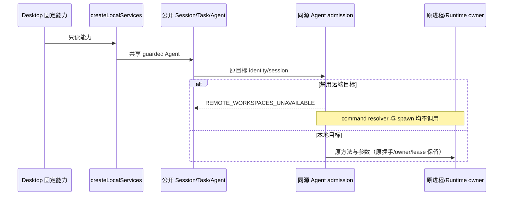
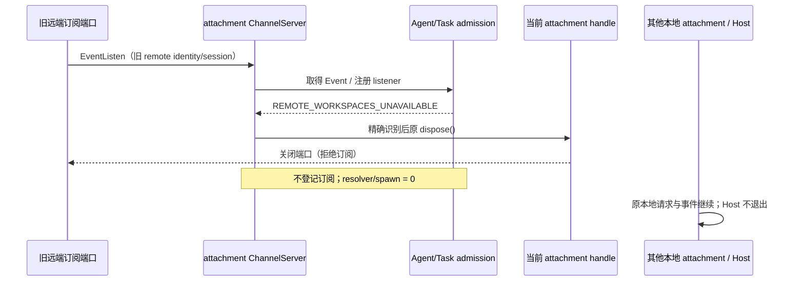
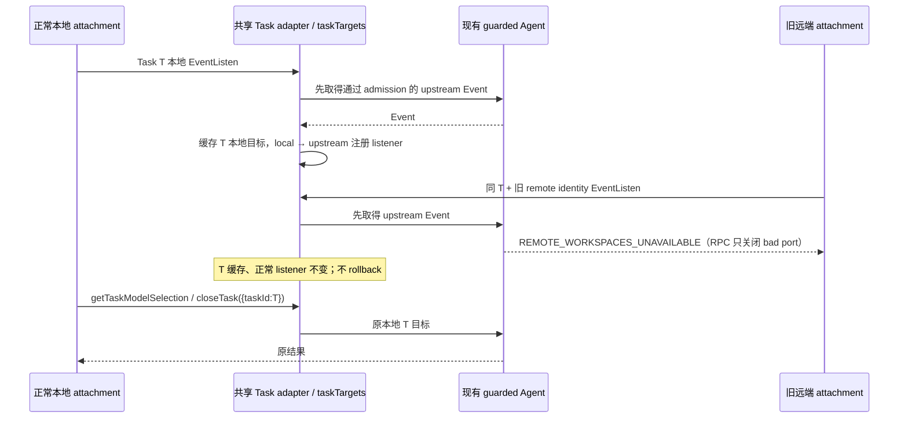
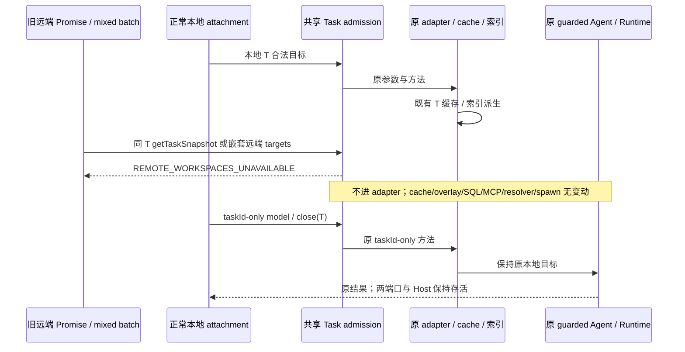
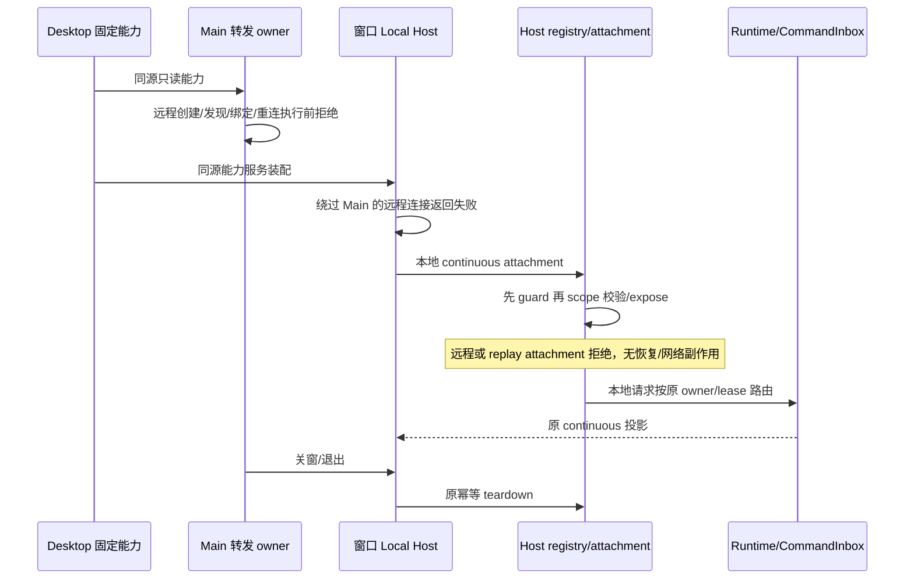
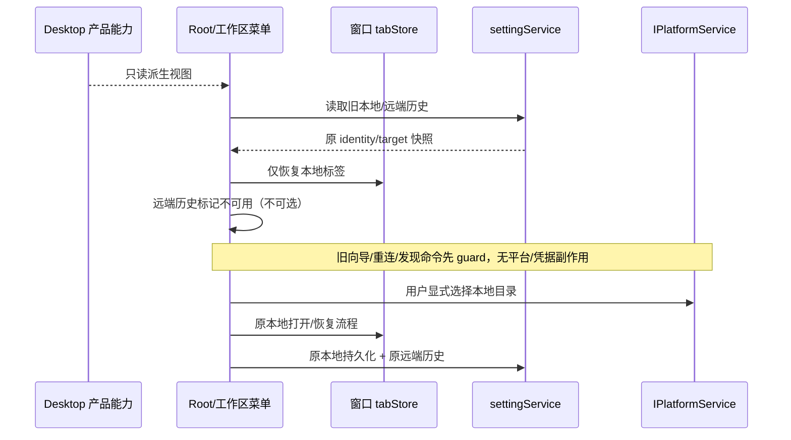

# Issue #5 远程工作区与手机 attachment 执行边界

## 本阶段范围与所有者

Desktop 产品组装层 `main/productCapabilities.ts` 是固定只读能力的唯一来源。Main remoteSessionManager 仅保留转发/端口关联；每窗口 Local Host 仍拥有连接 registry、attachment 生命周期和本地服务。服务与通用 registry 只接受只读能力，不复制产品固定事实。CLI Runtime/CommandInbox 继续拥有已接受输入、会话和执行状态。

本阶段关闭 Desktop 的远程管理（SSH/WSL/Docker/server 连接、发现、部署、绑定、Bot 重连、历史 attachment 恢复）及手机 replay attachment 创建。旧数据不删除、不重写 identity、不映射到同路径本地工作区。UI 阶段沿同源能力移除入口与远端标签恢复，具体规则见下文。

实际检出源码中 `WebRemoteControlDialog` 只装配 Bot Channel；Main/Host 无配对、二维码、relay 网络连接或 relay 心跳 owner，也无相关平台 IPC。因此不恢复已移除模块，不将 Bot Channel 心跳误当手机 relay。遗留 `web-remote-replayable` attachment 调度仍需执行 guard。server 整包和共享 replay/continuous 协议保留。

## 接口、错误与初始化

- 共享公开契约提供 `REMOTE_WORKSPACES_UNAVAILABLE`、`MOBILE_REMOTE_CONTROL_UNAVAILABLE` 和基于传入能力的 assert；未传入视图的其他产品保持原行为。
- Main 创建、绑定、Bot runtime port、重连、手机 attachment 在查 Host、解析 WSL、解析资源、创建端口或发送消息前拒绝。重挂载在禁用时不调度；正常取消、dispose 和本地 Host teardown 保持幂等清理。
- ConnectRemote 保留 `{success:false,error}`；bind 等 Promise 请求以不可用码拒绝。发现返回既有空列表/false 且不 import backend、不读取 SSH 配置、不启动发现进程。
- Host ConnectRemoteWorkspace 返回已有 RemoteWorkspaceConnectFailed，不调用 registry.connect。Bind 拒绝不写状态；Attach 拒绝并关闭转移端口，不排入数据库初始化等待、不 expose RPC。最后 backend 创建边界再次 assert。
- Bot bridge 在注册 parentPort listener 和读取旧设置/凭据前选择禁用实现：isConnected=false、ensureConnected 明确失败、runtime 请求拒绝；本地 Bot 服务继续装配。Bot 工作区候选不从旧远端历史恢复，新绑定码及 workspace.set 在落盘前拒绝远端 identity；旧 Bot context 本身不清空。
- Host attachment registry 与 V4 scope 接受同源只读视图；replay facade 在订阅初始化前拒绝。带 remoteSessionId 或远程 identity 的请求拒绝，不剥离 scope 或回退本地。远端识别必须遵循原身份 key 的 trim 规则；带前后空白的旧远端 identity 不能绕过请求 guard、Bot 候选/绑定或 context 隔离，原持久化字符串不改写。

## Fresh review：公开 Session/Task admission

审查确认：仅在 Host 的 Agent connection facade guard 不够。公开 `IZCodeSessionService.readWorkspacePresentation` 与 `IZCodeTaskService.createTask` 持有组装层 Agent，可绕过 facade 并启动本地进程。`createLocalServices` 必须在把 Agent 交给任何消费者（Session、Task、Git、Bot、task-index 及公开 Agent 注册）之前统一套用已有 `assertWorkspaceTargetAvailable`；能力仍只读引用 Desktop owner，不在服务内复制固定值。

远端 identity（包括前后空白）与 Session/Agent 支持的旧 remoteSessionId 在 Agent 方法进入前报 `REMOTE_WORKSPACES_UNAVAILABLE`，不访问 command resolver、不 spawn，不改写目标、旧历史或同路径本地身份。Task 的既有 workspace 参数只公开 identity，不扩展 remoteSessionId 协议。连接 facade 仍独立拥有握手、订阅及 teardown；不将 connection-scope 搬给 Session/Task、不改变 owner/lease 或 Runtime 事实。未传能力的其他产品沿原语义执行。

回归直接使用公开装配的 Session/Task/Agent，不手工构建 facade：同一本地目录分别携带正常/带空白的 SSH、WSL、Docker 远端 identity，以及 Session 的旧 remoteSessionId，均明确拒绝且 command resolver/进程生命周期 spawn 计数为零。直接本地 Session 读取须到达原 command resolver；本地 continuous 握手仍成功，原 history 字节不改写。先实跑 red，再实现并重跑相关测试与根静态检查。本轮不改变 UI 交互。

## Fresh review：EventListen 拒绝隔离

远端 target guard 的同步不可用异常在 RPC EventListen 路径未隔离，会逃逸到 Host fatal handler，关闭共享本地 Host。修复只在 ChannelServer 取得 Event / 注册 listener 的同步 admission 边界提供可选 `onEventListenError(error): boolean`：返回 true 表示调用者已处理拒绝，服务器不登记该订阅；未传 handler、返回 false 或未知异常仍沿原路径抛出。运行中的事件消费异常不属于此 admission 处理，不能全局吞异常。RPC 不认识产品配置或错误常量，不变更消息 schema。Task adapter 先注册本地 listener 再注册上游；上游拒绝时须释放已获取的 localDisposable 并原样重抛，否则 attachment 无法取得 cleanup handle。正常注册顺序/返回 cleanup 不变，重复拒绝不增长 listener，其他正常 listener 不被释放。

Desktop Host 使用独立可测的 admission handler，同进程仅精确识别 `error instanceof Error && error.message === REMOTE_WORKSPACES_UNAVAILABLE`（现有 guard 无 code 字段，非反序列化对象）。匹配时调用当前 attachment 原 `handle.dispose()`，关闭 offending port 并复用原 scope/controller/flow 清理；不返回假成功事件、不关闭共享 Host 或其他 attachment。不匹配普通对象、相近 message 或其他 Error。每个 attachment 的原 handle 仍是生命周期唯一所有者，产品固定配置仍由 Desktop owner 提供。构造 ChannelServer 时尚无 channel，原 native MessagePort 后续消息分发发生于 handle 完成之后；不引入延迟或 timeout。

回归通过真实 ChannelServer 序列化 EventListen 消息调用公开装配的 Agent connection facade 和 Task adapter（不是只直接方法调用），断言远端 identity、空白 identity、Agent 旧 remoteSessionId 关闭该端口、resolver/spawn 为零；另一端口的本地请求及事件仍工作。补默认 handler/未知错误不吞、listener 注册拒绝、运行中事件未知异常反证。先记录实际 red 再实现；此组件测试不冒充真实 Electron Host 进程存活证据，另实跑既有 backend E2E。

## Fresh recheck：Task target 缓存 admission 顺序

Task adapter 的 `taskTargets` 仍是其唯一目标缓存，原 taskId-only `getTaskModelSelection` / `closeTask` 从该缓存读取目标；不改 key、公开接口或所有者。本轮确认远端 EventListen 先 rememberTaskTarget 再经过 guarded Agent，能用同 taskId 覆盖另一正常本地 attachment 的已接受目标。

最小修复是在任何 rememberTaskTarget / 本地 emitter/listener 变动之前，先取得通过现有 guarded Agent `onDynamicSessionEvent` 的 upstream Event。远端拒绝原样抛出到已修 RPC admission 边界，只关闭 offending attachment；不修改缓存、不创建本地 listener、不进入 resolver/spawn。通过 admission 后按原顺序 rememberTaskTarget，并返回 Event；真正注册仍是 local listener → upstream listener，上游注册失败仍释放 localDisposable 并原样重抛。不得增加第二 guard 路径、缓存 rollback（可能覆盖并发合法写入）、超时或新的产品事实。后续真实异步订阅失败沿原 Runtime 语义，不扩大为缓存事务重设计。

验收先实跑 red：同一共享 adapter 的两个真实 ChannelServer 端口，本地 Task T 先正常订阅与缓存；另一 attachment 携带同 T、同路径和旧远端 identity（含空白变体）EventListen 被拒绝后，正常端口 taskId-only getTaskModelSelection 与 closeTask 仍成功且传给 Agent 的目标保持本地。该测试使用现有公开共享 guard 与受控 Agent/索引端口，不冒充真实模型；公开装配的远端 resolver/spawn=0 用例继续执行。另覆盖 lookup admission 在本地 listener 前、local→upstream listener 注册顺序与注册失败释放恰一次；保留 RPC 未知错误重抛。本轮重建实跑两种身份 backend Host 存活专项与真实模型/Skills/MCP 核心回归，组件零计数不冒充实进程计数。

## Fresh recheck：Task 服务统一 admission-before-mutation

`resumeSnapshot` 在 guarded Agent 之前写共享目标并准备 MCP；仅修 EventListen 不覆盖 Promise 入站。现统一在 `createLocalServices` 把 Task adapter 交给 RPC/Bots/OffPeak/其他消费者前设置只读同源 workspace admission。Agent/Task 复用极小 typed proxy，裁决仍仅 `assertWorkspaceTargetAvailable`，不复制固定能力或身份规则。Agent/connection scope 保留原边界、握手与订阅所有权；Task adapter 不承担新产品配置。无能力/未禁用的产品保持原行为。

Task 每个公开调用的首对象明确 target 在进入任何缓存/overlay/队列/索引/文件/MCP 准备前裁决；taskId-only、workspace 字符串、本地 identity/空白 fallback 参数继续原语义。旧 IPC 额外携带 remoteSessionId 时也不能被剥离后回落本地，不扩展 Task 公开参数或 wire schema。嵌套目标只解释当前 typed 契约，不递归扫描任意 payload：`listTaskList`、`listGroupedTaskViewStructure`、group rename/color/delete 的 workspaceScopes，以及 `applyGroupedTaskViewOrder` 的 workspaceScopes、topLevelNodes.task、groups.taskRefs 必须完整批预检；mixed local/remote 在任何一项 SQL/overlay/cache 变动前整体拒绝，不逐项执行后 rollback。

### 全部缓存写入与合法所有者审计

| 写入/入口                                                                                     | 原所有者与 admission 边界                                                                                                                                                                                                                                                            |
| --------------------------------------------------------------------------------------------- | ------------------------------------------------------------------------------------------------------------------------------------------------------------------------------------------------------------------------------------------------------------------------------------ |
| rememberTaskTarget #1：resumeSnapshot                                                         | 入站 getTaskSnapshot/WithEtag、resumeTask、配置/恢复链；公开 Task proxy 先裁决，内部 taskId-only 使用已接受 target；保留原恢复与 MCP 顺序，不再在消费者追加 guard/rollback                                                                                                           |
| rememberTaskTarget #2：snapshotToMeta                                                         | 来自成功 Agent create/resume/read 快照的派生投影；Runtime 是会话事实 owner，adapter 翻译并 syncTaskIndexMeta，不从拒绝入站生成快照                                                                                                                                                   |
| rememberTaskTarget #3：onDynamicTaskEvent                                                     | 已修 lookup-before-remember 保留；公开 Task admission 先于方法体，内部 Event 取得仍经过 guarded Agent；注册 local→upstream，注册失败局部清理保留                                                                                                                                     |
| rememberIndexedTaskMeta / syncTaskIndexMeta                                                   | TaskIndexRepo 持久化 meta 是 sticky automation 归属唯一来源；listTasks/Pinned/Archived、getTaskMeta、listTaskList、group order、导入、归档来自合法索引/成功 Runtime 派生结果；显式入站 scope（含集合）先裁决。不删除旧索引/group/remote 元数据、不重写缓存 key 或 persisted identity |
| overlay、live-tool、runtimeCommands、ownerRun                                                 | 仍分别由原 adapter、syncer 与 Runtime 事件持有；delete/archive/rename/unread、enqueue/promote/cancel 与显式 stop/permission/goal 等先通过同一 Task admission；内部终态/ready/投影事件仍走原 owner、stale run、CommandInbox 语义                                                      |
| taskId-only 模型/配置/close、全局 pinned IDs、无 scope group 创建、unsupported mailbox/branch | 不是携带新显式 workspace target 的入口；继续原 target owner/返回契约。body/ref/toolSlice/no-op 同样受入站 admission，不将远端伪装为成功 null                                                                                                                                         |

验收先通过真实公开装配和两个 ChannelServer 实跑 red：同 T 本地缓存后，另一端口 snapshot/resume/create 与远端普通/空白 identity、旧 remoteSessionId 的 Promise 请求明确拒绝，随后正常端口同 T 模型/关闭成功；resolver/spawn/MCP 准备零，正常参数不变。使用受控成功 Agent 方法但保留实际装配 Agent guard；公开注册 Task、Bots 持有的同一个 proxy。每类 typed nested target mixed batch 均拒绝，SQL mutation trap/索引状态及 adapter memory diagnostics 证明不发生 repo/overlay/cache 变动；local-only batch 继续原契约。未知 RPC 异常隔离、EventListen lookup/注册与局部 cleanup 回归继续，不改协议。再次实跑两种身份 Host E2E 与当前源码核心/Skills/MCP；组件与真实模型/Host 证据分开报告。

## 保留边界

保留每窗口一个 Local Host、本地 workspace 共享 Host、owner/lease、`workspaceIdentity?.trim() || workspacePath`、stale run、CommandInbox、会话恢复、共享 snapshot/stream/queue、desktop-continuous 与 web-remote-replayable 协议定义。普通授权 Agent shell SSH/Docker、浏览器、Provider/API key、HTTP/stdio MCP 和必要 OAuth 不受产品远程管理 guard 影响。不移动状态，不改协议。

## 验收

集成补充：使用实际 `DESKTOP_PRODUCT_CAPABILITIES` 与公开 `createLocalServices` 注册的 BotsService/Agent，不另造固定能力。旧远端与同路径本地 history 同时存在时，仅本地候选可用；远端 bind code 在读取 Bot 配置/启动 Agent 前拒绝。实际注册 Agent 的本地 continuous facade 正常 hello/initialize，带远端 identity/remoteSessionId 的请求在 command resolver 前拒绝；手机 facade 在初始化前拒绝。测试等待原 Provider owner 初始化后 teardown，不引入产品超时/状态 owner。此装配测试补充组件注入测试与原生 E2E，不能替代真实模型、多 GUI 窗口或全进程网络证据。

先补失败测试再实现：真实 Main IPC 旧 SSH/WSL/Docker/server 请求返回不可用，发现回调计数为零；真实 manager 创建/绑定/Bot/replay 请求不查 Host、不解析资源、不创建端口；旧 Bot 设置/凭据不读、不发送 parentPort 请求。registry replay/remote attach 不 resolve/expose；同路径远程 identity 的 V4 请求不调用 base，正常本地连续握手保持可用；两个独立窗口 registry 本地 attach/close/dispose 隔离。

实际 Electron 多窗口与本地核心/Skills/MCP 回归采用现有 Desktop E2E 入口；本阶段组件证据不冒充 GUI/安装包/真实 relay 服务验证。Linux 之外平台和需要凭据的验证按可用环境报告。architecture context：desktop/services/shared 都为 unmanaged、无 module.ts/受管契约；原公共包入口仍为跨包边界，不新增 Runtime 具体依赖。

## UI 阶段规则、时序与验收

UI 从 `IPlatformService.productCapabilities` 读取 Desktop 固定事实；不新建开关/配置所有者。Root 壳层的 allowRemoteWorkspace 只能进一步收窄，不能覆盖产品关闭。向导包装组件在挂载包含 effects 的子组件之前 guard；发现 hook 的 effect 与显式 Docker 刷新、便捷连接 hook、直接历史重连函数在调用平台/凭据/状态写入前再次裁决。错误复用公开 `REMOTE_WORKSPACES_UNAVAILABLE`，不把拒绝伪装为已连接。

既有 settingService 拥有历史，tabStore 拥有窗口 UI 标签，remoteWorkspaceSessionStore 拥有远端代理映射。禁用恢复不创建远端标签、不绑定旧 remoteSessionId、不注册远程恢复/log listeners；已有远端 teardown 可以清理代理，但不删除持久化历史。远程历史在工作区菜单展示为不可点击的“本地版本不可用”项，保留原 identity 与目标提示；同一菜单保持“打开本地工作区”。绝不通过历史 workspacePath 调用本地打开；同路径本地与多个远端身份分别测试。原本本地 Host 启动、退出与会话恢复保留。实际进一步核查发现 BotsDialog 唯一调用者是旧远控包装，无独立设置入口；为避免误删保留的 Bot 配置，在原 WorkspaceSidebarFooter 位置提供独立 WorkspaceBotsTrigger，直接使用既有 BotsDialog/Bot 图标/bots.title 文案。产品关闭 mobileRemoteControl 时仅显示独立 Bot 入口，未关闭的平台保持原包装，不同时显示重复入口。不新增 Bot 服务状态或轮询。

实际旧远控包装组件只包含 Bot Channel；mobileRemoteControl=false 时触发器及直接 dialog mount 都不渲染其 effect-bearing 子树，不移除独立 Bot 配置/正常轮询。当前无二维码、配对/relay owner，因此不添加虚构禁用 API 或恢复已删模块。

先添加 red 测试：直接挂载旧远控/向导不进入子树；禁用发现 effect 与 Docker 手动刷新不调用平台；直接历史重连不读凭据/写状态；allowRemoteWorkspaceRestore=true 也不绕过产品能力、remoteSessionId/identity 不转本地；关闭标签不重绑或删历史。交互 E2E 使用真实 Electron 重建，在旧 SSH/WSL/Docker history 共用本地路径时启动/重启，操作工作区菜单验证不可用三项、无远端/远控入口、保留本地打开路径与独立 Bots 配置；查看本地会话，退出 0，旧 identity 保留。实际组件测试与 E2E 结果分开记录，不将端口隔离测试当作全部网络抓包或真实模型恢复验收。
