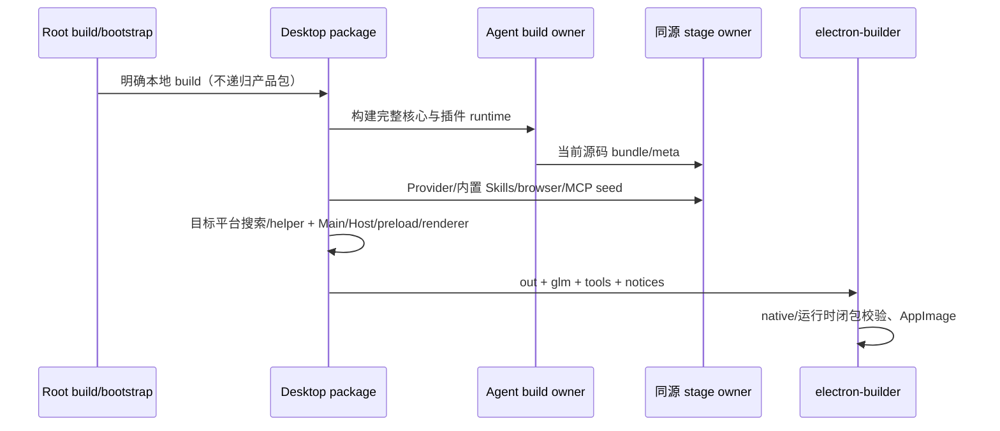

# Issue #6：Desktop 专用构建与发行闭包

## 规则、证据与所有者

仅发布本地 Desktop。固定产品能力唯一所有者仍为 Desktop 产品组装层；构建脚本不复制可变能力配置。根 `build` / `build:bootstrap` 复用唯一明确 Desktop 构建入口，bootstrap 只安装依赖并运行该入口。准备资源只执行本地 Agent、搜索工具与目标平台必要 helper，无需 skip 环境。Desktop 的 Main/Host 编译直接消费 workspace 公开源码导出，不需要 server HTTP/remote dist。

旧链路证据：根 `build` 是 `pnpm -r build`；`build:bootstrap` 包筛选包含 Web/server；server `build` 嵌套 `build:remote`；Desktop `prepare-runtime-assets` 默认调用 `prepare:remote-assets` → `prepare-prebuilds` 下载跨平台 Node、打 server/Agent/mock-cdn；`build:zcode` 构建 server/Web 并收集进发行包；统一 runner 第一参数 `--web` 可启动 HTTP server。以上发行入口与 Web/server dev、remote-prod、server-cli stage 均停止，保留源码/辅助函数至 #7 按引用删除。

状态及资源所有者：

- 根 scripts 只负责顺序与命令分发；Desktop package 负责本地产品构建和资源准备。
- `build-desktop-agent-cli` 负责 Agent 完整 workspace 编译；`stage-agent-bundle` 是 dev/生产同源 bundle/meta 暂存 owner，不凭旧文件存在复用。
- `prepare-agent-node-bundle` 继续携带 browser-use、node-repl、bundled-skills、Provider 与必要资源；`electron-builder` 携带目标平台 glm/tools 和许可。
- 动态 require 的运行时闭包仍由现有 runtime-dependency-closure 计算。OTEL/ssh2 等仍可被当前遗留外置 import 引用，不凭关闭配置删除依赖；物理清理留 #7。
- CLI Runtime/CommandInbox、会话持久化、owner/lease、identity、stale run 与共享恢复协议所有者不变，无协议更改、数据迁移或数据清空。

## 接口与错误

保留 `pnpm build`、`pnpm build:bootstrap`、`pnpm bootstrap`、`pnpm prepare:desktop-runtime`、`pnpm bundle:desktop`。移除 dev:web/dev:server/dev:desktop:remote-prod/build:zcode/prepare:remote-assets/bootstrap:with-remote 及 package 产品发行入口。旧直接脚本在安装、进程、网络、文件副作用之前明确失败；bootstrap 的旧 `--with-remote` 参数明确拒绝，不静默解释为成功。旧 runner 仅拒绝首参数产品选择 `--web`；普通 Agent 参数、prompt、`--` 之后文本、浏览器能力保留。

正常构建错误保持非零退出；缺 Agent/Skills/MCP/搜索资源仍按原校验失败，不新增超时或容错掩盖缺失。默认 bundle 只准备一次 runtime assets，再执行 no-runtime-assets 生产构建；显式 skip 参数仍为诊断用途，不是产品关闭依据。

## 顺序

## 验收

1. 先失败测试：manifest 默认构建无递归 Web/server/remote；bootstrap 无 submodule/远程准备；旧直接脚本和 --web 在副作用前失败；默认 runtime plan 没有远程资源且保留目标搜索和 Agent；同源 stage 清掉旧二进制，必要 Skills/browser/MCP/provider 清单保留。
2. 实际删除本机构建输出（非用户数据、非依赖缓存）后 `pnpm build`，验证没有重新生成 Web/server dist/mock-cdn；当前源码 Agent 与 staged bundle hash 一致。
3. 实际本机生产 AppImage，审计 asar/resources，无 Web/server 发行树/mock-cdn/远端 Node，必要 glm/Skills/MCP/搜索存在；跑安装包关闭冒烟与真实模型调用。
4. `e2e/run-build.mjs --executable <当前 AppImage>` 复用既有 runtime，使用合法旧账号/市场/share/SSH/WSL/Docker 历史并启动/退出/重启真实安装包。检查偏好和设置 DOM、真实 preload 远程/更新结果、Main 旧 OAuth/支付/分享 intent 路由、文件保留、本机市场陷阱与 Chromium netlog。不替换 Agent、生产业务 guard 或 store；包内不可访问的 Host RPC/IPC Promise 绕过由现有组件和开发专项验证，明确限制，不宣称全进程流量或所有远端进程创建覆盖。
5. 有仓库外授权 key 时跑既有真实核心 `--extensions --telemetry` 回归，不输出 key/填 key 截图。已关闭能力的专项实际跑或明确记录其安装包覆盖缺口。
6. 执行根 typecheck/lint、架构检查、格式与 CLI typecheck。Linux 本机依赖缓存保留，不宣称全新 OS 或 Windows/macOS/签名已验证。
7. 集成阶段重新执行安装包综合关闭、更新与遥测/模型专项；production 开发构建重新执行账号、市场/分享、远程 backend/UI 专项，以覆盖包内不可访问的 Main/Host 请求绕过、旧 EventListen/Promise admission 和本地 attachment 继续存活。核心/扩展使用现有 runner 实跑，不将 fixture 或静态包内容当成模型/Skills/MCP 执行。

最终命令结果、生产产物 hash、原始报告位置、新旧失败区别与未验证平台见 [Issue #6 实施结果](issue6-results.md)。
