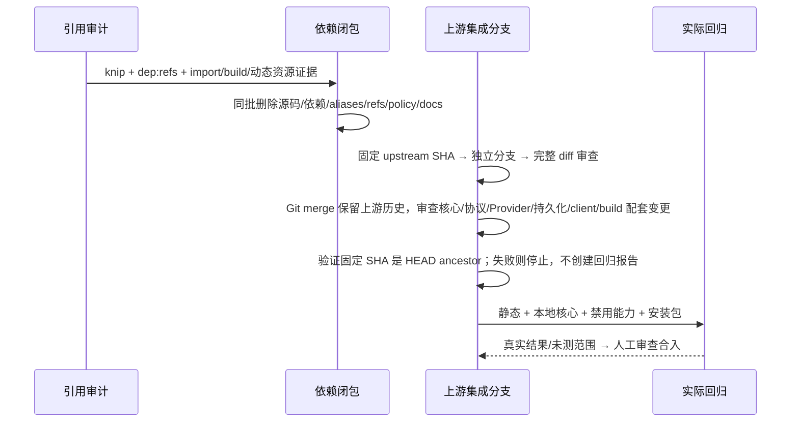

# Issue #7：引用闭包清理与上游回归

状态：已实现并完成 Linux x64 本机回归；最终单次本地提交由 integration 阶段完成。只清理已关闭产品的无消费者闭包，不改变核心运行行为或状态所有者。

## 所有者、接口与错误

- Desktop `productCapabilities.ts` 仍是固定产品能力唯一所有者；本 issue 不复制开关、不修改协议。
- Runtime/CommandInbox、Host owner/lease、workspace identity、stale run 与持久化所有者保持不变。
- 删除以 import、动态加载、build/watch、资源复制、公开 exports、TS references、workspace/lockfile、架构策略组成的原子闭包为单位。仅工具标记 unused 不足以删除。
- 保留仍被 Desktop 静态/动态导入的 server remote 库、通用鉴权、Provider、插件 loader、工作流、浏览器/CUA、Skills/MCP 资产及第三方许可声明。server 整包有剩余消费者时不删除。
- 禁用能力现有执行 guard 与明确不可用结果继续保留；移除产品包后旧路径只能模块不存在，不能恢复发行或副作用。不清理用户数据。
- 上游校验必须固定可解析 SHA/tag，在独立分支/工作树执行，不覆盖 CLI 目录、不拉取未来版本；缺凭据/安装包/显示环境时不得报告完整行为通过。
- 维护者负责选定固定上游提交、通过保留上游历史的 Git merge 集成并审查；流程脚本负责验证该 SHA 是本地 HEAD 的 ancestor。门禁仅支持 Git merge，不支持普通 cherry-pick（复制提交不保留来源 ancestry）；来源检查失败时在回归及报告创建前退出非零。保留现有来源 guard，不新增映射或放宽检查，也不改变 Runtime/产品配置所有者。

## 时序与边界

## 验收

1. 首先增加失败的闭包测试：无调用 Web 与独立 server-cli 包及配置引用均不存在；保留 server 与核心资源可解析。
2. 运行 knip（允许报告存量 unused，逐项判断）、dep:refs，并记录删除和保留依据；文档不列出已删除命令。
3. 删除后实际执行类型、lint、架构、受影响文件格式、干净输出 Desktop build 与现有运行入口。测试文件与动态资源不得因 unused 报告误删。
4. 可执行 upstream regression 流程必须检查固定提交、隔离分支、配套 diff、真实 runner 参数；基线演练只证明当前 upstream 的隔离审查，不宣称已合入未来更新。
5. Windows/macOS、真实 MCP OAuth、未覆盖的安装包完整核心等场景独立列出，不用静态审计冒充 E2E。
6. integration 校验将既有 UI/services/Desktop 执行 guard/同源装配聚合测试及 Agent telemetry 测试纳入 `--verify`，不只检查文件闭包。默认 `pnpm build` 是正常构建，不自动清输出；已完成的单独干净输出演练另外记录。
7. 文档的可执行集成方式只允许保留 ancestry 的 Git merge，明确普通 cherry-pick 不受门禁支持；契约测试防止重新宣传与来源 guard 矛盾的集成方式。
8. 参数解析在任何 Git/文件副作用前拒绝未知、重复、缺值参数、模式冲突及不适用于当前模式的参数；worktree/report/key-file 必须在 checkout 外，按平台路径关系判断，不将内部 `..name` 当父目录。非法输入只返回明确错误，不建立分支、写报告或读取凭据。

## 审计记录

继续核查发现 server 的 HTTP 产品入口只有包内 `entry-http → index/http → hostCapability` 消费；`dep:refs createHttpServer` 无外部调用。删除该 HTTP 闭包和无发行消费者的 tsup/build validation 配置；同时移除无外部消费者的 entry-stdio 启动/生命周期/deviceMid/内置配置闭包。保留 `stdio.ts` 协议适配及 `stdioServices.ts`（Desktop remoteMarketplaceAssembly 测试仍直接验证同源能力传递），保留 remote 库公开入口。删除产品宿主 ticket helper 不影响 MCP OAuth/Provider 通用凭据。同步 exports、HTTP-only Hono、旧 server 打包依赖与 knip entry，先测试其不存在再删除。remote 库实际第三方 import 仅 `ssh2`，没有 package 动态 require；旧 `node-pty/@lydell` 仅被已删除 prepare-prebuilds 消费，本地 Desktop 自有 node-pty/prebuild owner，不受影响。保留 server 的 workspace client/rpc/services/shared 与 ssh2/types/node/TypeScript；移除旧 HTTP/打包复制用 axios/form-data/forge/ws/yaml/ZIP/undici 等声明以及 tsup/esbuild/tsx。

### 删除闭包及依据

| 闭包                                                                          | 真实依据                                                                                                                                                                       | 同批更新                                                                                                                    |
| ----------------------------------------------------------------------------- | ------------------------------------------------------------------------------------------------------------------------------------------------------------------------------ | --------------------------------------------------------------------------------------------------------------------------- |
| `packages/web`（1168 个 tracked 文件，含 Web 专有 HTML/favicon/icon/font/UI） | main.tsx 零 exports；无包外运行 import/动态加载/构建复制消费者，Desktop 自有 renderer/public。已关闭默认发行；实际 Desktop/核心/包内运行验证资源完整                           | 根 typecheck、lockfile importer、architecture web 模块、README/AGENTS/skill 阅读入口、只读 Timeline 能力注释                |
| `packages/zcode-server-cli`（47 个 tracked 文件）                             | `dep:refs runServerCli` 仅 main.ts 两处包内调用、index re-export；无包外 build/运行消费者；旧 stage 早已拒绝                                                                   | 根 typecheck、lockfile、architecture 模块、旧 stage 测试改为删除断言、gitignore、NOTICE 产品安全说明                        |
| server HTTP/stdio **产品启动** 及构建闭包（11 个文件）                        | `createHttpServer` 仅 entry-http 两处包内调用；entry-stdio 无外部消费者，生命周期/deviceMid/bundled-config 仅被该入口调用。无调用的 ticket helper 随 HTTP 删除，不动 MCP OAuth | 去 root export，保留 remote/stdio exports；knip entry 改保留入口；删除 HTTP/旧 bundle 专用 deps/devDeps；完整 lockfile 更新 |
| 旧远端资源 preparer 与独占工具                                                | prepare-prebuilds 的导出无调用者；remote-native helper 只被其导入；distribution assets/installer/smoke 无调用者（旧统一发行已拒绝），不删除 legacy runner 的 --web guard       | preparer 收敛为副作用前拒绝 stub；保留 .sh 委托；更新 native-search README                                                  |
| macOS remote-only rg13 两个归档                                               | 只有已删 remote plan 选择它们；Desktop/SEA 全部使用 rg14。shared 远程协议版本描述保留但不是本地归档加载者                                                                      | 删除两个 archive 与 SHA256SUMS 对应行；保留第三方许可/source inventory 声明                                                 |
| Agent noop telemetry SDK 声明                                                 | telemetry/src 实际第三方 import 仅 @opentelemetry/api；旧 exporter 为 public no-op 且测试直接验证；knip 报 7 个未使用 SDK/exporter/context deps                                | 删除7项 dependency、lockfile；保留 @opentelemetry/api/contracts 与完整上游目录/测试                                         |

### 保留的模块与必要边

根 workspace 当前 31 个项目（含根）：

- `desktop → ui/services/client/shared/rpc/provider/provider-node/server/remote/zcode-cua`；server remote 同时含 Host 动态 backend import、Main WSL/editor resolver、附件/录屏类型边，因此不是零依赖整包。WSL/SSH/Docker 执行仍在产品 guard 后；不恢复入口。
- `ui → services` 公共 hooks、shared/rpc/client；本地 Timeline、Skills/MCP/已安装插件管理继续使用，不因名字含 Share/Plugin 删展示或 loader。
- `services → rpc/shared/provider/provider-node/zcode-cua`；`shared/provider/provider-node → model-option-map`，Provider 本地配置与凭据、持久化、通用鉴权、Bot、本地日志/诊断和 owner/lease 完整保留。formal-proof 无产品关闭决定，作为独立现有通用库保留，不虚报为服务依赖。仍被这些公共接口/测试或 lazy guarded importer 引用的账号/市场/遥测兼容代码保留。
- Agent：`cli → bootstrap/core/adapters/contracts/shared-types/i18n/telemetry/dynamic-workflow-runtime`；`dynamic-workflow` 生成运行时库；node-repl-host/browser-use-plugin/必要 Skills/docs/MCP resources 由 Desktop 同源 build/staging 读取。swift-bridge/TUI 与 CLI 必要原生依赖保留；debug、prompt-trajectory、tools/typescript 为上游维护/测试入口保留，不大改 Agent 布局。
- server 的 stdioServices 被 Desktop remoteMarketplaceAssembly 直接测试引用；stdio 协议、remote 子 exports/共享 continuous/replay 恢复协议保留。不把产品关闭解释为删除通用 IPC 或 Agent 网络能力。
- 动态资源：native-search rg14/bfs/ugrep 16 归档、Electron node-pty/prebuild、Browser Use/Node REPL、bundled-skills、Provider 内置配置、office/pdf/renderer 资产仍由现有 build/config/runtime closure owner 复制/发现，已实际干净输出构建与包内运行。
- `THIRD-PARTY-NOTICES.md`、`third-party/**`、LICENSE 与第三方材料完全未修改。其 Web/rg13 路径是历史许可/source inventory，不作为活动引用；`apps/zcode-cli/skills-lock.json` 的 Web 路径属于外部 anomalyco/opentui source，不是本仓库悬空路径。

workspace 使用 `packages/*` 自动发现，无需复制静态包列表。现存 TS references/aliases/watch 指向保留模块；删除的两包没有外部 TS reference/alias/watch root。Desktop 的 `@zcode/server` noExternal/watch 仍承载 remote 子图，不误删。所有目标 context 均为 legacy/unmanaged，module.ts 缺失且无直接契约；已有 managed storage 模块未改动。

### 工具及验证限制

`pnpm knip` 清理前 exit 1：78 unused files、60 deps、32 devDeps、401 exports、9 unlisted deps；最终 exit 1：67 files、38 deps、30 devDeps、398 exports、8 unlisted deps。不是零 unused 门禁：真实 E2E/test、动态 build/runtime assets 和 public/upstream contracts 有 false positives。未删除本地 core/debug/工作流/Provider/OAuth/插件 loader；没有新增 unresolved import。

`pnpm dep:refs` 实跑列出 Web main 零 exports、server-cli index 38 exports、remote index 30 exports；runServerCli 和 createHttpServer 引用仅各自包内；pickRemoteRuntimeEnv 有 Desktop Host 与 assembly test 消费。静态工具不检测全部 dynamic import；已结合真实源码/构建和实际 runner 运行，不用此结果替代 E2E。

最终静态、构建、运行报告与未测范围见 [Issue #7 结果](issue7-results.md)；固定 upstream SHA/隔离基线演练与 executable full gate 见 [上游回归流程](upstream-regression.md)。
