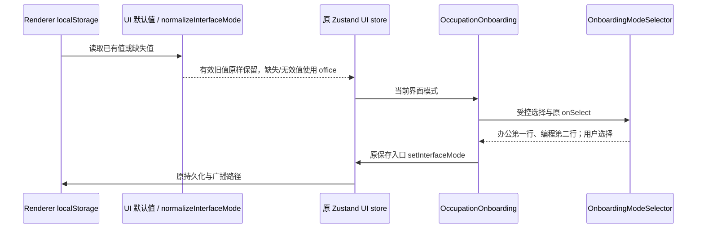

# 首次引导默认办公模式

## 规则与边界

- 没有有效界面模式偏好时，默认使用 `office`（办公模式）。首次引导第二步默认选中办公模式，办公模式在第一行、编程模式在第二行。
- 已保存的 `coding` / `office` 继续恢复原值；旧 `general` / `concise` 仍兼容办公模式。不更改 localStorage key，不清除或覆盖已有选择，不改写旧引导记录。
- 默认值在 `packages/ui/src/lib/interfaceMode.ts` 统一定义，由原 UI store 的规范化入口读取；缺少 store provider 时的模式 hook 与设置组件缺省值复用它。
- `OnboardingModeSelector` 只改变渲染顺序，选中态仍由 `OccupationOnboarding` 控制。用户可正常选择编程模式；保存、重开、键盘切换和广播仍使用原路径。
- 工作区记忆和主动任务推荐仍沿用既有引导规则：默认办公模式下默认勾选，用户可在第三步调整；主动选择编程模式时恢复原编程偏好语义，不增加新设置写入路径。
- 不修改布局、主题、文案、国际化 key、模型、权限、Agent/runtime、协议或业务状态所有者。桌面和窄屏共用同一选项组件与顺序。

## 状态所有者与顺序

变更属于架构策略中的 legacy `ui` 模块。界面模式仍由 Renderer Zustand store 拥有并写入 `zcode-interface-mode`；引导只保留尚未保存的局部选择，最近引导记录的预填优先级保持现有实现。

## 验收

1. 先补规范化测试：缺失、空值、无效值默认 office；显式 coding / office 与旧别名正确恢复。
2. 扩展既有 `packages/desktop/e2e/run-first-run.mjs`：真实第二步核验两行顺序、办公默认选中及垂直位置；通过原 UI 完成引导，重启保留办公选择。
3. 新模拟目录仍默认办公；主动选择第二行编程并完成引导，重启保留编程选择，手动重开引导恢复记录中的编程选择。
4. 执行 `pnpm typecheck`、`pnpm lint`、changed 架构检查和本次文件格式检查。E2E 留存截图与报告，区分本机验证与未测的平台。

## 验证记录

2026-10-05，Linux x64，Node 24.14.0 / pnpm 10.33.2：

- 先新增规范化测试，旧实现 2 项失败、2 项兼容场景通过；实现后 `pnpm exec tsx --test packages/ui/test/interfaceMode.test.ts` 4/4 通过。
- 从当前源码重建 Agent/Desktop 后运行 `pnpm exec tsx packages/desktop/e2e/run-first-run.mjs`，4 个真实 Electron 场景通过：办公在第一行且默认选中、办公完成后重启、新模拟目录主动选编程、编程重启及手动重开引导恢复。四次启动均正常退出，继承的旧文件内容不变。
- 截图与报告保留在 `packages/desktop/.e2e-artifacts/first-run-1791210902977/`；默认办公及已保存编程的第二步截图已人工复核，选项垂直位置和 `aria-pressed` 同时核验。
- `pnpm typecheck` 通过；`pnpm lint` 0 errors / 70 条已有 warnings，本次改动文件无诊断。本次文件格式及 tracked diff 空白检查通过。
- changed 架构检查在修改前后均为 0 violations / 0 baseline / 0 new。变更仅涉及原 legacy UI 的缺省值和选项顺序、现有首次启动 E2E、规范化测试与文档，原 store/引导记录所有者及保存顺序不变；本轮净增 123 行，排除之前任务和用户已有改动。
- 本机未执行 Windows/macOS、手机、安装器或真实模型场景；没有修改原 `mise run dev`、创建提交或推送，保留全部无关改动。
