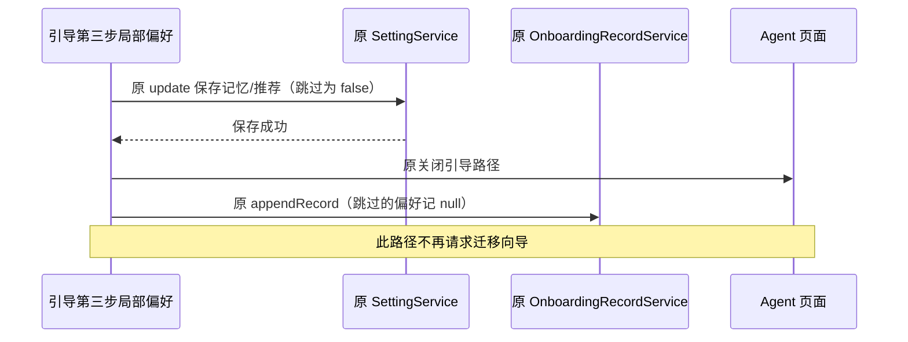

# 首次引导：工作助手偏好

## 产品规则

- 第三步“选择你的工作助手偏好”去掉“迁移会话数据”及其说明，中英文一致；所有界面模式下都不显示该选项。
- 办公模式只显示“开启主动任务推荐”“开启工作区记忆”，顺序、默认勾选及用户修改/最近记录恢复沿用原规则。
- 编程模式（及模式页跳过）只显示“开启工作区记忆”，不改变主动任务推荐仅在办公模式显示的原规则。
- 删除引导局部 migration 草稿及完成引导后的 requestOnboardingDialog("migration") 调用。点击“开始使用”或第三步“跳过”按原路径保存剩余偏好并进入 Agent 页面，不再从本引导请求迁移向导。
- 删除不再使用的 occupationOnboarding.migration / migrationDescription 翻译，结束事件不再记录 claude_code_history_migration_selected；原事件名称、去重、曝光范围和剩余字段保持。
- 本次只移除首次引导中的选择和触发路径；设置页已有的独立手动迁移能力、历史记录、全局向导和协议不在变更范围。引导记录本来未存 migration，无需清理或迁移用户数据。
- 第一二步的 12 项工作方向、默认不预选、办公默认及两种模式顺序继续保持。

## 状态所有者和保存顺序

源码变更限于 legacy ui。OccupationOnboarding 继续拥有 memory / suggestions 未提交草稿；SettingService 拥有运行时偏好，OnboardingRecordService 拥有用户最近作答，UI 使用原 hooks 和 RPC。只删除 migration 的临时状态与触发调用，不增加状态、服务或写入路径。原异步预填 userEditedRef、保存防重入、账号认领、写失败提示和记录写入失败规则保持。

## 验收

1. 在实现前扩展真实 Electron E2E：中文办公第三步只有两个选项，英文编程只有一个；无迁移名称或 Claude Code 说明。
2. 验证办公默认勾选、可切换并保存、重启手动重开恢复；第三步跳过仍写 settings false / record null。编程默认记忆关闭，完成及重启不出现迁移对话框。
3. 保留当前首次启动、方向选择、跳过、模式顺序/保存/重启和旧 fixture 不改写场景；留存第三步中英文主题截图。
4. 执行 pnpm typecheck、pnpm lint、changed 架构和本次文件格式检查，记录实际结果和未测试的平台。

## 验证记录

2026-10-05，Linux x64，Node 24.14.0 / pnpm 10.33.2：

- 实现前新增真实第三步断言，在上轮现有 Electron 构建与全新隔离目录上确认失败：办公实际 3 项，期望 2 项；进程正常退出。
- 修改后重建实际 Agent/Desktop，首次启动 E2E 4/4 通过，四次启动正常退出。中文办公只有推荐/记忆两项且默认勾选，取消后 settings/record 均为 false，重启手动重开恢复；第三步跳过写 settings false / record null。英文编程只有记忆一项且默认关闭，完成及重开恢复正确；完成和跳过后均进入 Agent 页面、无迁移对话框。原 12 项方向、模式顺序/默认值、第一步跳过和旧 fixture 不改写场景继续通过。
- 报告与截图：`packages/desktop/.e2e-artifacts/first-run-1791213160060/`；`office-preferences.png` 与 `coding-preferences.png` 已人工复核，分别覆盖中文浅色和英文深色。
- 上轮方向 UI/服务、界面模式、首次启动命令回归联合运行 17/17 通过。`pnpm typecheck` 通过；`pnpm lint` 0 errors / 70 条已有 warnings，本次改动文件无诊断。本次文件格式与 tracked diff 空白检查通过。
- 修改前后 changed 架构检查均为 0 violations / 0 baseline / 0 new。仅 legacy ui 源码、原 Desktop E2E 和文档变化；状态所有者、RPC、保存与记录顺序保持，删除引导迁移草稿和请求路径。本轮净增 97 行，排除用户已有改动和前几轮任务。
- 本机未执行 Windows/macOS、真实手机、安装器或模型场景；没有修改独立手动迁移能力、原开发命令，没有提交或推送。
