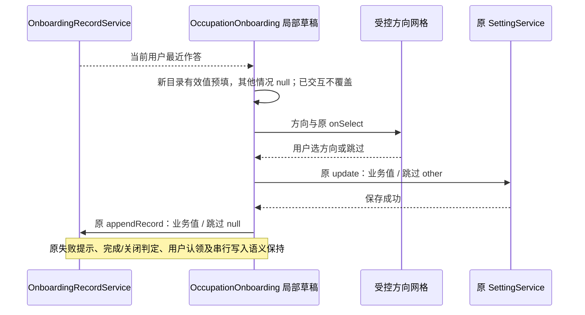

# 郑商智助首次引导：主要工作方向

## 产品规则

首次引导第一步面向郑州商品交易所员工，以日常职责分类，不对应正式部门编制。标题保留“你的主要工作方向是？”，说明为“选择最接近你日常职责的一项，让郑商智助更懂你的工作。”。目前主动任务建议仍由界面模式和原偏好开关控制，本次只调整方向选择与保存，不宣称已按岗位生成专属推荐。

每项显示图标、名称、简短任务说明，按以下顺序展示；宽屏两列按行排列，窄屏一列，不截断说明、不产生横向滚动，长内容沿原内容区滚动。

| 保存值               | 名称               | 任务说明                                   |
| -------------------- | ------------------ | ------------------------------------------ |
| administration       | 综合办公与行政     | 公文起草、会议纪要、汇报材料、工作督办     |
| research             | 研究分析与品种研发 | 产业研究、市场分析、品种资料、研究报告     |
| market_service       | 市场推广与产业服务 | 企业调研、业务宣介、培训材料、活动策划     |
| member_service       | 会员管理与业务支持 | 会员材料整理、业务答疑、通知编写、服务记录 |
| trading_settlement   | 交易与结算业务     | 交易统计、结算核对、资金报表、业务流程查阅 |
| delivery_warehousing | 交割与仓储管理     | 交割资料、仓单数据、仓储信息、流程核对     |
| risk_surveillance    | 风险管理与市场监察 | 风险数据分析、异常线索整理、监测报告       |
| legal_audit          | 法律合规与审计监督 | 法规检索、条款对照、制度检查、审计材料     |
| technology_data      | 信息技术与数据支持 | 开发运维、日志排查、数据处理、自动化脚本   |
| finance_procurement  | 财务与采购管理     | 预算统计、费用汇总、采购材料、财务报表     |
| party_hr             | 党务与组织人事     | 党务材料、人事信息整理、培训计划、组织工作 |
| other                | 其他工作           | 通用问答、材料整理及其他任务               |

- 首次默认不预选任何方向；选择后“下一步”才启用，用户可改选、返回或跳过。
- 跳过第一步仍进入第二步；记录中的 occupation 保留 null，settings 保持既有 other fallback，不能把跳过误记为主动选择“其他工作”。
- 第二步仍是办公模式第一行、编程模式第二行，新用户默认办公，已保存模式原样恢复。
- 中英文同时更新名称与说明，沿用现有主题、字号 token、选择按钮、焦点反馈及引导布局。
- 使用新的稳定业务值，不把旧 developer、finance、legal 等值重新解释为具体岗位；旧 settings 值继续通过读取、patch 和记录同步校验，旧记录不迁移、不清除。
- 手动重新打开时，最近记录中的有效新值预填；null、已退出展示列表的旧值或未知值保持未选择。异步预填仍遵守原 userEditedRef，不能覆盖用户已做的选择。

## 状态所有者、接口与边界

方向目录与兼容设置值由 legacy shared 的纯数据文件定义，经 @zcode/shared 公开入口供 UI 读取；AppSettings 类型、完整设置校验、patch 校验和记录同步共享该集合。图标、翻译属于 legacy ui，不进入协议。OccupationOnboarding 继续拥有未提交的方向局部状态；运行时设置仍由 SettingService 持有，用户最近作答仍由 OnboardingRecordService 持有，两者经原 hooks、RPC 和串行记录写入路径保存。

原引导结束埋点的 work_direction 使用新目录中的稳定值，跳过仍是字符串 null，其余事件、去重和提交时机保持。此次不改变 Agent、工具权限、模型、队列、远程链路、record 版本、账号认领或持久化位置，也不另建状态所有者。

## 验收与验证

1. 先补测试：12 项新值通过完整设置及 patch 校验，旧值兼容，无效值拒绝；新目录可预填，旧值和 null 不自动映射；两种语言均具备全部名称、说明。
2. 原首次启动 Electron E2E 扩展：中英文 12 项、顺序、无默认选择、“下一步”禁用；选中后启用、返回保留、保存重启与手动重开预填；跳过 null/other 区分；第二步办公默认和编程手动选择恢复；旧 fixture 不变。
3. 真实窄屏单列、宽屏双列及浅/深主题截图复核；通过原服务验证新值从 record 同步回 settings，兼容旧记录。
4. 运行定向测试、pnpm typecheck、pnpm lint、changed 架构与本次文件格式检查，记录实际结果及环境限制。

## 验证记录

2026-10-05，Linux x64，Node 24.14.0 / pnpm 10.33.2：

- 测试先于实现新增：旧实现 7 项中 5 项失败，确认新方向、设置校验、预填与翻译缺失；2 项旧值/无效值兼容场景通过。实现后联合执行新方向 UI/服务测试、界面模式测试、首次启动命令测试，17/17 通过。
- 当前源码重建 Agent/Desktop 后，原首次启动 Electron E2E 4/4 通过，四次启动均退出码 0。中文浅色主题验证默认无选择、12 项名称/任务说明/顺序、双列和窄屏单列、返回保留与改选、research 保存到 settings/record、重启不再引导和手动重开预填；英文深色主题验证跳过记录 null / settings other、办公仍默认、主动选择编程及重开恢复。继承的旧 fixture 文件保持原内容。
- 第一轮交互断言通过，但初次截图仍显示 HTML 启动动画遮罩；E2E 改为等待原 body ready 状态及遮罩实际移除，再完整重跑。最终截图和报告为 `packages/desktop/.e2e-artifacts/first-run-1791212395689/`，中文宽/窄屏、英文深色截图已人工复核。
- 新方向从原 OnboardingRecordService 同步回 settings 通过全部 12 项验证；旧 developer/finance/legal 保留，跳过回填 other，读与同步不改写原记录。完整设置和 patch 均保留原全部职业值，未知值仍被拒绝。
- `pnpm typecheck` 通过；`pnpm lint` 0 errors / 70 条已有 warnings，本次改动文件无诊断。本次文件格式与 tracked diff 空白检查通过。
- 架构检查修改前后均为 0 violations / 0 baseline / 0 new。源码修改属于 legacy ui/shared；services 仅新增恢复验证，Desktop 仅扩展原 E2E。工作方向草稿、运行时设置、最近作答仍分别由原引导组件、SettingService、OnboardingRecordService 持有，原命令、异步预填防覆盖及保存顺序不变。本轮净增 439 行，排除用户已有品牌修改和之前启动命令/默认模式任务。
- 本机未验证 Windows/macOS、真实手机、安装器或模型执行；本次未修改原 `mise run dev`，没有提交或推送，保留全部无关改动。
