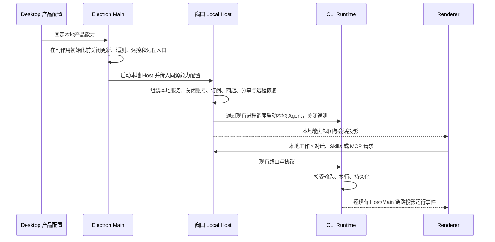

# 本地 Desktop Fork 产品范围与关闭规则

状态：Issue #1–#6 的更新、遥测、产品账号/订阅、市场/分享、远程/手机 attachment 执行关闭及 Desktop 专用发行链已实现。Issue #7 已完成无消费者产品闭包物理清理与固定上游回归流程，保留仍被调用的核心/兼容库。Linux x64 的实际结果与未测范围分别记录；不是全平台或所有保留能力的完整验证。

本 Fork 只发布本地 Desktop 客户端，复用 ZCode Agent Runtime，保留 Skills 与 MCP，并持续集成上游核心更新。本阶段关闭 Web 产品、更新、插件商店、账号、订阅、分享、遥测、远程工作区和手机远控。先关闭产品入口与执行路径，再按依赖证据删除源码，避免破坏核心运行链。

## 已确认的产品范围

用户已明确关闭下表能力；这些能力不再作为本阶段待定项。

| 能力              | 本阶段规则                                                                  |
| ----------------- | --------------------------------------------------------------------------- |
| 本地 Desktop      | 保留本地工作区、窗口、文件操作和本地 Agent 进程                             |
| Agent Runtime     | 保留对话、工具、权限、输入 admission、会话持久化与恢复                      |
| Skills            | 保留用户级与工作区级发现、加载、使用及必要管理入口                          |
| MCP               | 保留服务配置、连接、工具调用和必要鉴权                                      |
| 模型配置          | 保留本地 Provider 配置与模型调用；不能要求产品账号登录或产品订阅            |
| Web 产品          | 不发布 Web 客户端、独立 Web 服务或统一 CLI 中的 Web 发行入口                |
| 应用更新          | 关闭自动更新、手动检查、下载、安装及启动强制升级检查                        |
| 插件商店          | 关闭官方及个人市场的浏览、来源管理、刷新、商店下载、安装与更新路径          |
| 产品账号          | 关闭登录、注册、账号 OAuth、账号状态刷新、账号模型凭据拉取与相关入口        |
| 产品订阅          | 关闭购买、套餐、权益、订阅状态刷新及产品订阅准入判断                        |
| 分享              | 关闭会话发布、上传、分享链接生成及分享链接导入流程                          |
| 遥测              | 关闭 Desktop Main、Host、Renderer 和 Agent 的产品遥测采集、排队、导出与上报 |
| SSH 远程工作区    | 关闭发现、连接、恢复、远端部署与远程资源准备路径                            |
| WSL 远程工作区    | 关闭发行版发现、连接、恢复与远端部署路径                                    |
| Docker 远程工作区 | 关闭容器发现、连接、恢复与远端部署路径                                      |
| 手机远控          | 关闭配对、二维码、relay 连接、心跳、attachment 创建与恢复                   |

## 关闭语义与保留边界

关闭能力意味着入口不可见、命令不可执行、对应后台任务不启动、旧配置不能恢复能力。禁止仅隐藏按钮或仅依靠配置字段为空实现关闭。

- 关闭产品账号不删除通用凭据管理；模型 API key 与 MCP 连接所需凭据仍可使用。MCP 自身需要的 OAuth 不属于产品账号登录。
- 关闭产品订阅不修改模型服务返回的鉴权、计费或额度错误语义，也不绕过外部 Provider 的访问限制。
- 关闭远程工作区不禁止 MCP 的 HTTP 传输或模型网络调用，也不禁止用户通过正常 Agent 工具执行 SSH、Docker 等命令。本阶段关闭的是产品的远程工作区管理能力。
- 关闭 Web 产品不等于关闭 Agent 的浏览器使用能力，也不删除核心协议所需的本地通信设施。
- 关闭插件商店不删除插件 manifest、已安装本地资源的加载机制，以及承载 Skills、MCP 的必要运行资源。剩余管理入口不得继续跳转到商店或自动请求市场。
- 关闭遥测仍保留现有本地日志、诊断和会话存储；日志不得经遥测路径上传。遥测关闭同时覆盖正常运行、退出 flush、崩溃路径和 Agent 子进程环境。
- 已有远程历史、账号配置或遥测队列不能触发后台恢复和上传；本阶段不自动删除用户数据。持久化迁移另行设计。
- 清理后继续保留完整核心依赖目录与协议兼容边界，以及仍被 Desktop 引用的 remote、account、plugin 或 telemetry 契约/guard；不按文件名删除。
- 自动化、工作流、浏览器使用、Computer Use 等其他能力本轮未新增关闭决定，不自动扩大裁剪范围。

## 状态所有者与接口要求

Issue #1 已实现 Desktop 固定能力配置及 Main → preload → 平台适配 → UI 的只读接口。当前落实应用更新、产品遥测、产品账号/订阅、市场/分享与远程/手机 attachment 关闭；Issue #6 已将默认构建收敛为明确的 Desktop 闭包，旧 Web/server 产品与远程部署资产入口在副作用前拒绝，不把配置中的 false 当作执行关闭证据。

| 状态或事实               | 唯一所有者                                  | 读取方与规则                                                                           |
| ------------------------ | ------------------------------------------- | -------------------------------------------------------------------------------------- |
| 产品能力集合             | Desktop 产品组装层的固定配置                | Main、Host、UI 与 Agent 启动适配读取同一配置；不允许个人设置、远端配置或旧历史重新开启 |
| Provider 配置与凭据      | 现有 Provider 配置与凭据服务                | UI 通过 hooks 访问；关闭账号配置源后，本地配置仍能进入现有 Provider Runtime            |
| 已接受输入和执行状态     | CLI Runtime / CommandInbox                  | Host 路由，UI 仅维护草稿和 pending optimistic overlay                                  |
| 会话运行事实与内容       | CLI Runtime 及现有持久化链                  | 保留现有恢复与事件投影，不能转由 Main 持有                                             |
| 本地 Host 生命周期与绑定 | 每窗口的 Local Host 与既有 owner/lease 边界 | 本地 workspace 复用窗口 Host，保留 stale run 与身份隔离防护                            |
| 禁用能力的旧持久化数据   | 原有存储所有者                              | 可保留存储，但读取不能执行恢复、连接、上传或刷新                                       |

实现接口要求：

1. 产品能力采用严格类型，默认只允许明确保留的产品能力；不复用 `production / preview` 身份作为总开关。
2. UI 读取派生的产品能力视图，隐藏入口；平台请求继续经过 `IPlatformService`，不直接调用原生桥。
3. Main 与 Host 在创建服务、注册可执行入口及处理请求时落实关闭规则；旧 UI、快捷键、菜单、深链和历史恢复均不能绕过。
4. Agent 启动适配必须关闭自身遥测初始化和导出，并停止向子进程注入产品遥测配置；只关闭 Renderer SDK 不满足要求。
5. 禁用路径使用现有错误或结果契约返回明确的不可用结果；不得伪装为连接成功或订阅有效。
6. 只有发生跨进程协议改动时才扩展共享协议，同时提供运行时校验；尽量保留现有 Agent 协议以降低上游同步成本。

## 初始化与事件顺序

实际实现前需核对现有启动调用顺序。不能先启动禁用能力，再依靠延迟、超时或异步关闭来掩盖副作用。

## 当前源码证据与实施入口

下表是当前保留的实现阅读入口；关闭执行证据见各 issue 结果，不把静态阅读入口当作 E2E。

| 关注点             | 当前文件                                                                                                                                          | 实施核查                                          |
| ------------------ | ------------------------------------------------------------------------------------------------------------------------------------------------- | ------------------------------------------------- |
| Desktop 启动与更新 | `packages/desktop/src/main/index.ts`、`packages/desktop/src/main/autoUpdater.ts`、`packages/desktop/src/main/forceUpdateGuard.ts`                 | 后台初始化、手动检查、强制升级及菜单命令          |
| 服务装配           | `packages/services/src/node.ts` 的 `createLocalServices`                                                                                          | 账号配置源、订阅、插件、分享与遥测适配的副作用    |
| 设置与商店入口     | `packages/ui/src/SettingsPage.tsx`、`packages/ui/src/settings/PluginStorePage.tsx`                                                                | 入口、hooks、后台刷新以及 Skills/MCP 到商店的跳转 |
| 分享服务           | `packages/services/src/conversation-share/conversationShareService.ts`、`packages/services/src/conversation-share/conversationShareHttpClient.ts` | 发布、读取与网络上传链路                          |
| 手机远控入口       | `packages/ui/src/WorkspaceWebRemoteControlTrigger.tsx`                                                                                            | 配对与 relay 链路需沿调用者继续审计               |
| 远程工作区         | `packages/desktop/src/host/index.ts`、`packages/desktop/src/main/desktopRuntimeEnv.ts`、`packages/server/src/remote`                              | Backend 装配、发现、恢复与资源部署                |
| Desktop 遥测       | `packages/desktop/src/main/appTelemetryRuntime.ts`、`packages/desktop/src/main/index.ts`                                                          | Main、Host、Renderer 的 SDK、采集任务及退出 flush |
| Agent 遥测         | `apps/zcode-cli/packages/bootstrap/src/telemetry-bootstrap.ts`、`packages/services/src/zcode-agent/agentTelemetryEnv.ts`                          | 初始化、环境传递、导出与退出 flush                |
| Agent 核心依赖     | `apps/zcode-cli/packages/core/package.json`、`apps/zcode-cli/packages/bootstrap/package.json`、`apps/zcode-cli/packages/adapters/package.json`    | 保留完整依赖闭包，避免只保留 core                 |
| 本地 Agent 打包    | `packages/desktop/scripts/prepare-agent-node-bundle.mjs`、`scripts/build-desktop-agent-cli.mjs`                                                   | bundle 与 Skills/MCP 资源保持完整                 |
| 远程资源准备       | `packages/desktop/scripts/prepare-runtime-assets.mjs`                                                                                             | 将关闭规则落实到构建链，不能只关闭运行入口        |

`@zcode/server` 的 remote 子入口仍有 Desktop Host/Main 静态和动态消费者，故保留；无消费者的 HTTP/stdio 产品启动闭包与 Web/独立 server-cli 产品包已物理删除。`stdioServices.ts` 与 stdio/remote 契约继续用于兼容边界和同源装配验证。根 workspace 通配符自动发现剩余 31 个项目，typecheck、exports、knip、架构策略、lockfile 和现行文档同步收敛。核心继续依赖共享协议、Provider、适配器、工作流、插件 loader 与必要资产，详见 [清理依据](issue7-cleanup.md)。

## 验收场景

以下为产品整体验收规则。变更前基线见 `baseline-results.md`；关闭后的 Linux 核心、Skills/MCP、专项及安装包冒烟已在各 issue 实际执行。包内完整生命周期/Skills/MCP、真实 MCP OAuth、Windows/macOS、全流量捕获及真正未来上游合入仍未实测，不能由现有结果推定通过。

| 场景             | 前置条件与动作                                                       | 必须断言                                                                            | 证据                                  |
| ---------------- | -------------------------------------------------------------------- | ----------------------------------------------------------------------------------- | ------------------------------------- |
| 首次启动         | 干净数据目录启动桌面应用                                             | 不要求产品登录或订阅；无关闭能力入口；不连接产品遥测、市场、分享、更新或 relay 服务 | Desktop E2E、网络记录、服务初始化记录 |
| 本地模型调用     | 配置本地 Provider/API key，发送消息                                  | 模型正常执行；不拉取账号模型凭据，不执行产品订阅准入判断                            | UI、协议与 Provider 请求              |
| 本地会话生命周期 | 打开工作区，执行工具、权限回答、追加输入、停止，再重启恢复           | CommandInbox 串行 admission、内容恢复与 stale run 防护保持原语义                    | E2E、运行事件与持久化                 |
| Skills           | 设置用户级与工作区级 Skills 并实际使用                               | 可以发现和调用；无商店跳转或远程同步请求                                            | UI、运行事件与文件                    |
| MCP              | 分别配置 stdio 与 HTTP MCP 并调用工具                                | 连接、鉴权与工具调用正常；失败按原契约展示；不依赖产品账号                          | UI、MCP 进程/网络与运行事件           |
| 旧配置恢复       | 使用包含账号、订阅、更新、分享、远控和远程工作区历史的旧数据目录启动 | 不恢复禁用能力，不触发旧遥测队列上传；本地数据仍可使用                              | E2E、网络与文件读写                   |
| 绕过入口         | 调用旧菜单、快捷键、深链或已关闭能力请求                             | 明确不可用，且无创建连接、上传、下载或安装副作用                                    | 命令结果与网络/进程记录               |
| 遥测关闭         | 执行一次对话、工具调用及应用退出，模拟错误路径                       | Main、Host、Renderer、Agent 均无遥测采集与导出任务；本地日志仍可诊断                | 进程配置、初始化记录与网络记录        |
| 发布构建         | 在干净构建环境生成 Desktop 包并实际运行                              | 包含本地 Agent、Skills/MCP 必需资源；不构建或携带 Web 产品及不再需要的远程发行资源  | 构建日志、包内容与安装包 E2E          |
| 上游同步         | 集成新的上游固定 commit/tag                                          | 新增入口与后台任务仍受产品能力规则约束；核心及共享协议保持兼容                      | 变更审查、静态检查与核心 E2E          |

## 实施顺序与验证要求

1. 新增统一产品能力接口及禁用路径测试，再修改启动和服务装配。
2. 优先消除更新、遥测、账号/订阅、商店、分享、远程工作区和远控的启动副作用及旧配置恢复路径。
3. 移除 UI、菜单、快捷键与深链入口，保留 Skills、MCP 与模型配置的独立路径。
4. 改造 Desktop 构建链，停止 Web 和远程发行资源准备，验证干净安装包。
5. 使用 `pnpm knip` 与 `pnpm dep:refs` 核查引用，再删除无依赖源码、包和配置；同步清理实际失效的文档与技能引用。

代码实施必须使用 architecture-governance 技能，先执行架构检查并读取目标模块上下文。静态验证包含 `pnpm typecheck`、`pnpm lint`、`pnpm architecture:check --changed`；Agent workspace 另有 `pnpm --dir apps/zcode-cli typecheck` 入口，需准备其依赖产物后执行。根目录 typecheck 不直接覆盖全部 CLI workspace。

现已建立本地核心基线入口 `pnpm --filter @zcode/desktop e2e:baseline --key-file <仓库外私有文件>`，场景与边界见 `e2e-baseline.md` 和 `packages/desktop/e2e/README.md`。该入口不等同于本表其他场景已经覆盖，完整结果仅按实际运行报告记录。

Node 与 pnpm 版本以 `mise.toml` 为准。保留上游历史，按固定 SHA/tag 在集成分支同步；同时检查 Agent、共享协议、Provider、存储和构建链配套变化。保留许可与第三方声明材料，不将凭据、用户数据或内部服务地址写入规格或日志。

## 规划索引缺口

feature-boundary-planner 已补充核实过的 Desktop 产品规则、应用更新执行和更新入口三个种子节点及两条依赖边。其余本地 Desktop 产品裁剪路径尚未完整覆盖，继续作为 graph-drift-candidate；不得把尚未接入执行边界的配置字段描述为已完成关闭。

首个 PR 的具体接口、失败语义、初始化顺序和验收场景见 [Issue #1 更新关闭规格](issue1-updates.md)。

Issue #1 的本机验收结果、证据与未验证范围见 [实施结果](issue1-results.md)。

Issue #2 的初始化、共享身份/队列边界与 no-op 契约见 [遥测关闭规格](issue2-telemetry.md)；实际核心、Skills/MCP、AppImage 与静态检查结果见 [实施结果](issue2-results.md)。

Issue #3 的服务、UI 与 Main 原生执行边界见 [账号/订阅关闭规格](issue3-account.md)；本地 Provider 持久化、真实核心/Skills/MCP 与关闭专项结果见 [实施结果](issue3-results.md)。

Issue #4 的服务/Host/CLI 市场、分享与 UI admission 见 [市场/分享关闭规格](issue4-marketplace-sharing.md)；同源装配、两种身份 Desktop 专项及真实核心/Skills/MCP 回归见 [实施结果](issue4-results.md)。

Issue #5 的 Main/Host/Bot/V4/UI 执行 guard、旧历史保留与本地边界见 [远程关闭规格](issue5-remote.md)；两种身份的真实 Desktop 专项、同源装配和真实核心/Skills/MCP 回归见 [实施结果](issue5-results.md)。当前检出没有手机 pairing/relay owner；保留共享恢复协议，不恢复已移除模块。

Issue #6 的默认 Desktop 构建、旧发行入口错误、完整 Agent/资产所有者与安装包验收见 [构建闭包规格](issue6-build.md)；该阶段真实回归见 [实施结果](issue6-results.md)。

Issue #7 的最终保留/删除闭包、工具报告限制与本机验证见 [清理依据](issue7-cleanup.md) 和 [实施结果](issue7-results.md)。固定 SHA、独立分支、配套变更审查与真实回归门禁见 [上游同步流程](upstream-regression.md)；基线演练不等同于合入未来版本。
